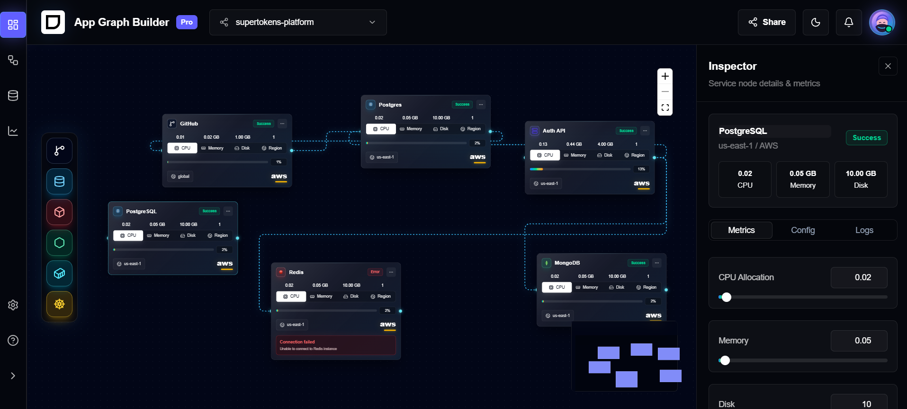
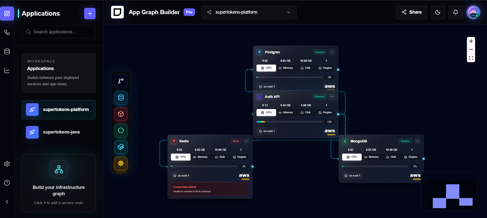
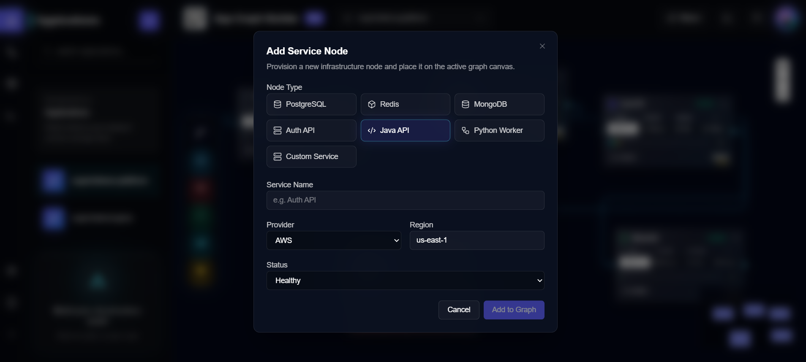
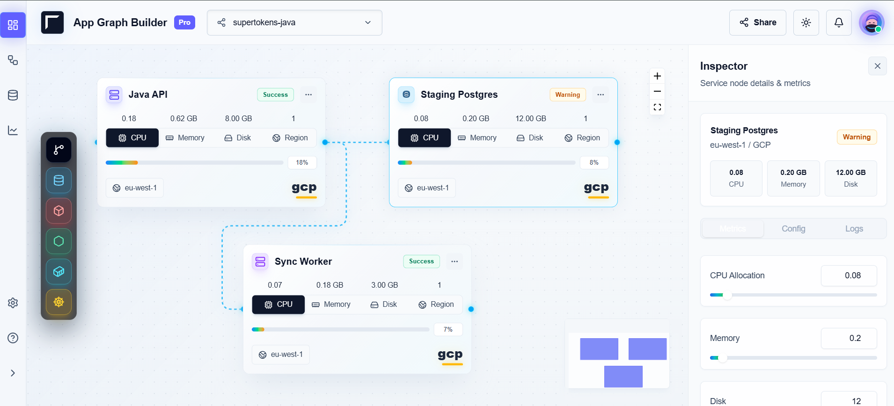

# Infrastructure Graph Dashboard

A futuristic infrastructure graph dashboard built with React, Vite, TypeScript, ReactFlow, Zustand, TanStack Query, MSW, Tailwind CSS, and shadcn-style UI primitives.

The interface is inspired by Railway, Vercel, Supabase Studio, and Render. It visualizes application infrastructure as an interactive graph, lets users inspect and edit service nodes, switch between application graphs, and add new infrastructure stack nodes through drag and drop.

## Live Demo

https://app-graph-builder-one.vercel.app/

## Project Overview

This project was built for a Frontend Intern Task focused on creating a polished infrastructure visualization experience with modern frontend architecture.

The dashboard loads application and graph data through an environment-aware mock API layer. In development, Mock Service Worker intercepts real `fetch()` calls so the app behaves like it is talking to backend endpoints. In production, the same API functions return local Promise-based mock data so the deployed Vercel app does not depend on Service Worker APIs or a backend server.

TanStack Query handles API caching and refetching, Zustand owns graph interaction state, and ReactFlow renders the interactive canvas.

## Live Demo

https://app-graph-builder-one.vercel.app/

## Reference video link:
(https://drive.google.com/file/d/10xIUeBSz7CL7FEAT-rekTcseWXZEAsV7/view?usp=sharing)


## Reference Screenshot







It demonstrates:

- Graph-based infrastructure visualization
- Environment-aware mock API integration with MSW in development and local services in production
- Stateful ReactFlow interactions
- A production-style inspector workflow
- Responsive SaaS dashboard layout
- Premium dark/light UI polish
- Dynamic infrastructure node creation by dragging technology stack icons directly onto the graph canvas

## Features

- **ReactFlow graph visualization** for infrastructure services and dependencies.
- **Dynamic graph rendering** based on the selected application.
- **Dynamic app switching** from the sidebar and topbar selector.
- **TanStack Query caching** for app and graph API responses.
- **MSW mock APIs in development** for `/api/apps` and `/api/apps/:appId/graph`.
- **Production-safe mock API architecture** with local Promise-based fallback data for static hosting.
- **Zustand global state** for selected app, selected node, graph nodes/edges, theme, sidebar state, and inspector tabs.
- **Floating draggable infrastructure stack toolbar** inside the graph canvas as a premium bonus feature beyond the original assignment requirements.
- **Dynamic infrastructure node creation** by dragging technology stack icons directly onto the graph canvas.
- **Dynamic infrastructure node generation** using shared service node data and Zustand graph mutations.
- **Drag-and-drop stack creation** for PostgreSQL, Redis, MongoDB, Docker, Kubernetes, and GitHub.
- **ReactFlow-aware drop positioning** so newly generated infrastructure nodes appear where the user drops them, even after zooming or panning.
- **Zustand graph synchronization** so dropped nodes immediately join the same graph state as API-loaded nodes.
- **Service node inspector panel** with metrics, config, and logs tabs.
- **Inspector synchronization** with selected ReactFlow nodes.
- **Editable node fields** for service name, region, description, CPU, memory, and disk.
- **Node deletion** from keyboard shortcuts and inspector confirmation dialog.
- **Connected edge cleanup** when nodes are deleted.
- **Graph zoom, pan, minimap, controls, and fit view** support.
- **Dotted graph canvas** with theme-aware styling.
- **Theme persistence** with stored light/dark mode.
- **Responsive layout** with mobile inspector drawer/overlay behavior and collapsible sidebar.
- **Premium splash/loading screen** before the dashboard fades in.
- **Stable ReactFlow config** to avoid nodeTypes/edgeTypes recreation warnings.

The dashboard supports dynamic infrastructure node creation by dragging technology stack icons directly onto the graph canvas.

## Tech Stack

| Technology | Why It Was Used |
| --- | --- |
| **React** | Component model for building the dashboard, inspector, graph canvas, and layout interactions. |
| **Vite** | Fast development server, TypeScript support, and optimized production build. |
| **TypeScript** | Strong typing for graph nodes, service data, Zustand actions, and API payloads. |
| **Tailwind CSS** | Utility-first styling for responsive layouts, glassmorphism, themes, and dashboard polish. |
| **shadcn/ui-style primitives** | Local UI primitives for buttons, dialogs, tabs, sliders, inputs, labels, textareas, and tooltips. |
| **ReactFlow** | Interactive graph rendering, node dragging, edge creation, zoom/pan, minimap, controls, and coordinate conversion for drag/drop. |
| **Zustand** | Lightweight global state for selected nodes, graph mutations, theme, sidebar behavior, and inspector synchronization. |
| **TanStack Query** | API fetching, caching, loading states, error states, and graph refetching on app switching. |
| **MSW** | Mock API layer that intercepts real browser `fetch()` requests during development. |
| **Lucide Icons** | Consistent iconography for navigation, graph nodes, toolbar stacks, actions, and status UI. |

## Architecture Overview

### Component Architecture

The app is organized around a dashboard shell:

- `App.tsx` handles theme persistence and the splash screen.
- `AppLayout` composes the sidebar, topbar, graph canvas, and inspector.
- `LeftRail` manages navigation sections, application list, sidebar expansion, and the add-node dialog.
- `Topbar` contains branding, app selector, theme toggle, notifications, and avatar.
- `GraphCanvas` owns ReactFlow rendering and canvas-level interactions.
- `ServiceNode` renders the custom infrastructure node card.
- `StackToolbar` provides draggable infrastructure stack icons.
- `RightPanel` provides the node inspector and deletion confirmation.

### State Management Flow

Zustand lives in `src/store/app-store.ts`.

It stores:

- `selectedAppId`
- `selectedNodeId`
- `nodes`
- `edges`
- `theme`
- sidebar expansion state
- active sidebar and inspector tabs

ReactFlow changes are routed through Zustand:

- `onNodesChange` applies node dragging and selection updates.
- `onEdgesChange` applies edge changes.
- `onConnect` creates new smoothstep edges.
- `addNode` creates nodes from the add-node dialog.
- `addStackNode` creates nodes from graph drag/drop.
- `updateNodeData` keeps inspector edits synchronized with graph nodes.
- `deleteSelectedNode` removes the selected node and all connected edges.

### API Flow

The app keeps API access behind functions in `src/mocks/mock-api.ts`:

- `getApps()`
- `getAppGraph(appId)`

TanStack Query in `AppLayout` consumes those functions:

- `queryKey: ["apps"]`
- `queryKey: ["graph", selectedAppId]`

In development, `src/main.tsx` starts MSW before React renders:

```ts
if (import.meta.env.DEV) {
  const { worker } = await import("./mocks/browser");
  await worker.start({ onUnhandledRequest: "bypass" });
}
```

Development behavior:

- `getApps()` calls `fetch("/api/apps")`.
- `getAppGraph()` calls `fetch("/api/apps/:appId/graph")`.
- MSW handlers in `src/mocks/handlers.ts` intercept those requests.
- TanStack Query receives realistic async responses and caches them normally.

Production behavior:

- MSW is not started.
- The app does not call `/api/...` routes.
- `getApps()` and `getAppGraph()` return cloned local mock data through Promise-based functions with simulated latency.
- The deployed Vercel build remains frontend-only and static-hosting compatible.

Changing the selected app updates Zustand, which changes the graph query key and refetches the selected graph.

### Graph Rendering System

`GraphCanvas` renders a controlled ReactFlow graph using Zustand-owned `nodes` and `edges`.

Implemented ReactFlow behavior:

- Custom `serviceNode` node type
- Smoothstep animated edges
- Minimap
- Controls
- Dot background
- Pane click deselection
- Node click selection
- Delete and Backspace keyboard deletion
- Fit view on graph/sidebar/selection changes
- Stable `nodeTypes`, `defaultEdgeOptions`, `fitViewOptions`, and `proOptions`
- Drop-to-create node support through ReactFlow coordinate conversion

### Inspector Synchronization

The inspector reads `selectedNodeId` and finds the matching node in Zustand.

When a user edits node data:

1. The inspector calls `updateNodeData`.
2. Zustand updates the matching node.
3. ReactFlow receives the updated `nodes` array.
4. The graph card and inspector stay synchronized.

Deletion follows the same centralized state path:

1. User clicks `Delete`.
2. Confirmation dialog opens.
3. `deleteSelectedNode` removes the node.
4. Connected edges are filtered out.
5. `selectedNodeId` is cleared, closing the inspector.

### Drag-and-Drop System

The dashboard supports dynamic infrastructure node creation by dragging technology stack icons directly onto the graph canvas.

`StackToolbar` exposes draggable stack buttons:

- PostgreSQL
- Redis
- MongoDB
- Docker
- Kubernetes
- GitHub

This is a premium/bonus interaction beyond the original assignment requirements. It makes the graph feel closer to modern infrastructure tools where users compose architecture visually instead of only viewing static data.

On drag start, the toolbar stores a stack type in `dataTransfer` using `STACK_DRAG_MIME`.

On canvas drop:

1. `GraphCanvas` reads the stack type.
2. ReactFlow converts screen coordinates to flow coordinates.
3. Zustand `addStackNode` creates a typed service node at the drop position.
4. The new node is selected immediately and can be inspected, dragged, edited, connected, or deleted.

The generated node uses the same `serviceNode` ReactFlow node type as API-loaded nodes, so inspector editing, deletion, edge cleanup, and graph synchronization all work through the same Zustand state flow.

More detail is available in [docs/drag-drop-system.md](docs/drag-drop-system.md).

## Folder Structure

```text
app-graph-builder/
|-- docs/
|   |-- assets/
|   |   `-- app-graph-builder-reference.png
|   |-- drag-drop-system.md
|   `-- interview-preparation.md
|-- public/
|   |-- anime-avatar.svg
|   `-- mockServiceWorker.js
|-- src/
|   |-- assets/
|   |   `-- favicon (2).png
|   |-- components/
|   |   |-- graph/
|   |   |   |-- add-node-dialog.tsx
|   |   |   |-- graph-canvas.tsx
|   |   |   |-- service-node.tsx
|   |   |   `-- stack-toolbar.tsx
|   |   |-- layout/
|   |   |   |-- app-layout.tsx
|   |   |   |-- left-rail.tsx
|   |   |   |-- right-panel.tsx
|   |   |   `-- topbar.tsx
|   |   `-- ui/
|   |       |-- alert-dialog.tsx
|   |       |-- button.tsx
|   |       |-- dialog.tsx
|   |       |-- input.tsx
|   |       |-- label.tsx
|   |       |-- slider.tsx
|   |       |-- tabs.tsx
|   |       |-- textarea.tsx
|   |       `-- tooltip.tsx
|   |-- lib/
|   |   |-- theme-styles.ts
|   |   `-- utils.ts
|   |-- mocks/
|   |   |-- browser.ts
|   |   |-- handlers.ts
|   |   `-- mock-api.ts
|   |-- store/
|   |   `-- app-store.ts
|   |-- App.tsx
|   |-- index.css
|   |-- main.tsx
|   `-- types.ts
|-- components.json
|-- index.html
|-- package.json
|-- tsconfig.json
|-- tsconfig.app.json
|-- tsconfig.node.json
`-- vite.config.ts
```

## Setup Instructions

Install dependencies:

```bash
npm install
```

Start the development server:

```bash
npm run dev
```

Build for production:

```bash
npm run build
```

Run TypeScript checks:

```bash
npm run typecheck
```

Run ESLint:

```bash
npm run lint
```

Preview the production build:

```bash
npm run preview
```

## Additional Documentation

- [Drag-and-Drop System](docs/drag-drop-system.md)
- [Interview Preparation](docs/interview-preparation.md)

## MSW Development Notes

MSW is enabled only in development.

The worker file is located at:

```text
public/mockServiceWorker.js
```

When the app runs locally, Chrome DevTools Network should show real Fetch/XHR requests:

```text
/api/apps
/api/apps/:appId/graph
```

The MSW handlers log:

```text
[MSW] /api/apps called
[MSW] graph API called
```

## Available Mock Applications

The mock API currently returns five applications:

- `supertokens-platform`
- `supertokens-java`
- `supertokens-python`
- `supertokens-ruby`
- `supertokens-go`

Each application has a realistic graph payload with service nodes, metrics, providers, regions, logs, and dependency edges.

## Interview Talking Points

- The app separates **server state** and **client interaction state**: TanStack Query owns API fetching/caching, while Zustand owns graph interaction state.
- MSW is used in development so the project still performs real browser `fetch()` requests without needing a backend server.
- Production uses local Promise-based mock services, so the deployed Vercel app does not depend on Service Worker APIs or API routes.
- ReactFlow is controlled through Zustand, which makes inspector edits, drag/drop creation, edge changes, and deletion predictable.
- The inspector is synchronized by storing only `selectedNodeId`, then deriving the active node from the graph state.
- The dashboard supports dynamic infrastructure node creation by dragging technology stack icons directly onto the graph canvas.
- The draggable stack toolbar is a premium/bonus feature: users can drag PostgreSQL, Redis, MongoDB, Docker, Kubernetes, or GitHub icons onto ReactFlow to generate real editable infrastructure nodes.
- Drag/drop uses ReactFlow coordinate conversion, so dropped nodes land accurately on the canvas regardless of zoom or pan.
- Zustand synchronizes generated nodes with the same graph state used by API-loaded nodes, which keeps dragging, editing, connecting, inspection, and deletion consistent.
- Node deletion is centralized in Zustand, so keyboard deletion and inspector deletion share the same edge-cleanup logic.
- Static ReactFlow configuration is kept outside render paths to avoid unnecessary re-renders and node type warnings.

More interview guidance is available in [docs/interview-preparation.md](docs/interview-preparation.md).

## Engineering Highlights

- **ReactFlow graph synchronization:** nodes and edges are controlled by Zustand, so dragging, connecting, editing, deleting, and app switching all update one shared graph state.
- **Zustand global state architecture:** selected app, selected node, graph data, theme, sidebar state, and inspector tabs are centralized without Redux-style boilerplate.
- **TanStack Query caching strategy:** app data and graph data are cached by stable query keys, including `["apps"]` and `["graph", selectedAppId]`.
- **MSW integration:** development requests still use real `fetch()` calls, intercepted by MSW handlers for realistic API behavior.
- **Production-safe API abstraction:** the same query functions return local mock data in production, keeping Vercel deployment static and backend-free.
- **Drag-and-drop infrastructure builder:** stack icons generate editable infrastructure nodes directly on the ReactFlow canvas.
- **Responsive dashboard system:** the layout supports desktop panels, collapsible navigation, and mobile inspector overlay behavior.
- **Inspector synchronization:** the inspector derives selected node data from Zustand and updates the same node rendered in ReactFlow.
- **ReactFlow optimization:** stable node types, stable edge options, memoized edge styling, and fit-view timing reduce unnecessary graph churn.

## Deployment

The application is deployed on Vercel:

https://app-graph-builder-one.vercel.app/

This project is a Vite single-page application with a frontend-only architecture. It does not require a real backend server for the assignment scope.

Development uses MSW to intercept browser `fetch()` requests and simulate backend APIs. Production uses local Promise-based mock services and static graph data, so the deployed build works on Vercel static hosting without Service Worker API dependency.

Production build command:

```bash
npm run build
```

Build output directory:

```text
dist
```

For most hosting providers:

- Build command: `npm run build`
- Output directory: `dist`

## Production Notes

- The assignment required a frontend-only implementation, so no backend server is used.
- Development API behavior is simulated with MSW and real browser `fetch()` calls.
- Production API behavior is simulated with local Promise-based mock services.
- Realistic async behavior is preserved through small artificial delays.
- Static deployment is optimized for Vercel and does not rely on runtime API routes.
- The current implementation focuses on the frontend task scope: graph visualization, state management, mock API flow, dynamic infrastructure node creation, and polished dashboard interactions.

## Future Improvements

- Real backend API integration for applications, graphs, nodes, and mutations.
- Live metrics from observability sources.
- WebSocket updates for real-time graph and status changes.
- Graph persistence for user-created nodes and edited service configuration.
- Collaboration support for shared architecture editing.
- Cloud provider API integrations for AWS, GCP, Azure, Kubernetes, and database services.
