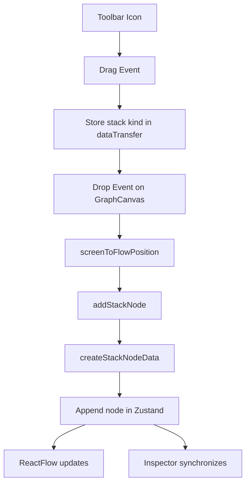
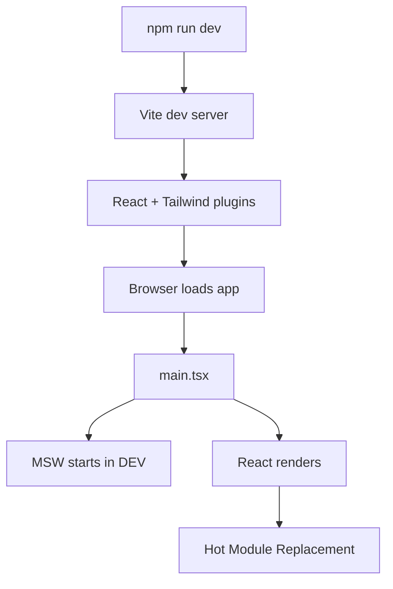
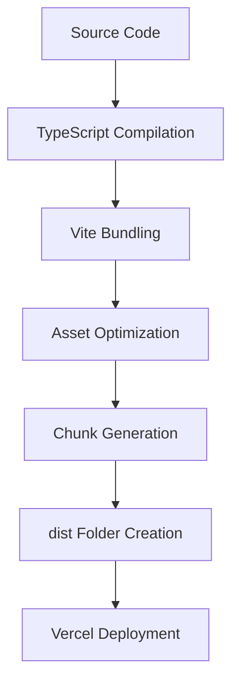

# Codebase Explanation and Interview Guide

This document explains the current App Graph Builder codebase for interview preparation. It focuses on what the code actually does, why each part exists, what depends on what, and what would break if important pieces changed.

## 1. Complete Project Overview

App Graph Builder is a frontend-only infrastructure graph dashboard. It displays application services as connected graph nodes, lets users switch between mock application graphs, inspect and edit node data, delete nodes with edge cleanup, toggle dark/light mode, and create new infrastructure nodes by dragging stack icons onto the graph canvas.

The project has five major systems:

- **React layout system:** `AppLayout`, `Topbar`, `LeftRail`, `RightPanel`, and graph components compose the dashboard.
- **ReactFlow graph system:** `GraphCanvas` renders controlled nodes and edges, and `ServiceNode` renders each custom infrastructure card.
- **Zustand interaction state:** `app-store.ts` owns selected app, selected node, graph nodes, edges, theme, sidebar state, mobile drawer state, and inspector tab state.
- **TanStack Query data state:** `AppLayout` loads apps and graphs through `getApps` and `getAppGraph`.
- **Mock API system:** development uses MSW and fetch interception; production uses local Promise-based mock data so Vercel static hosting works without backend routes.

The architecture was chosen to separate responsibilities. ReactFlow handles graph mechanics, Zustand handles UI and graph interaction state, TanStack Query handles async server-like data, and MSW/local services handle mock data. This separation makes the project easier to debug, explain, and later migrate to real backend APIs.

Main flows:

- App starts in `main.tsx`, optionally starts MSW in development, then renders React.
- `AppLayout` fetches apps, chooses an initial app, fetches the selected graph, and stores graph data in Zustand.
- `GraphCanvas` renders Zustand nodes and edges through ReactFlow.
- Selecting a node opens `RightPanel`, which edits the same node stored in Zustand.
- Dragging a stack icon sets drag metadata; dropping it on ReactFlow converts screen coordinates and creates a node.
- Mobile/tablet sidebar uses Zustand state to open a slide-in drawer.

## 2. Complete Folder Structure Explanation

### `src/`

The application source folder. It contains the React entry, global CSS, shared types, components, store, mocks, and utilities.

### `src/components/`

Contains reusable UI and feature components. It is split into graph-specific components, layout components, and UI primitives.

### `src/components/graph/`

Owns graph-related features:

- `graph-canvas.tsx`: ReactFlow integration and graph event handling.
- `service-node.tsx`: custom ReactFlow node UI.
- `stack-toolbar.tsx`: draggable technology stack buttons.
- `add-node-dialog.tsx`: form-based service node creation.

This folder exists because graph behavior is complex enough to deserve a separate feature area.

### `src/components/layout/`

Owns dashboard shell components:

- `app-layout.tsx`: data orchestration and page shell.
- `topbar.tsx`: brand, app selector, theme toggle, mobile menu button.
- `left-rail.tsx`: desktop sidebar and mobile sidebar drawer.
- `right-panel.tsx`: node inspector and mobile inspector drawer.

### `src/components/ui/`

Local shadcn-style UI primitives. These wrap common UI patterns such as buttons, dialogs, alert dialogs, inputs, tabs, sliders, textareas, labels, and tooltips.

### `src/store/`

Contains Zustand state:

- `app-store.ts`: global interaction state and graph mutation actions.

This folder exists because many components need shared state and actions.

### `src/mocks/`

Contains mock API infrastructure:

- `mock-api.ts`: mock apps, mock graphs, clone helpers, `getApps`, `getAppGraph`.
- `handlers.ts`: MSW route handlers for development.
- `browser.ts`: MSW browser worker setup.

### `src/lib/`

Contains small shared utilities:

- `utils.ts`: `cn()` helper combining `clsx` and `tailwind-merge`.
- `theme-styles.ts`: status badge styles by theme and service status.

### `src/hooks/`

There is no `hooks/` folder in the current implementation. Important hook logic lives directly in the components where it is used. For example, `GraphCanvas` owns ReactFlow event hooks, and `AppLayout` owns query hooks.

### `src/types.ts`

Shared TypeScript types for app summaries, service node data, ReactFlow nodes, and graph payloads.

## 3. Component-by-Component Breakdown

### `AppLayout`

Purpose: main dashboard layout and data coordinator.

Responsibilities:

- Run `useQuery` for apps.
- Select the first app when app data arrives and no app is selected.
- Run `useQuery` for the selected graph.
- Push graph data into Zustand with `setGraph`.
- Render `LeftRail`, `Topbar`, `GraphCanvas`, and `RightPanel`.

Props: none.

Hooks used:

- `useQuery` for apps.
- `useQuery` for graph.
- `useEffect` to set initial app.
- `useEffect` to store graph data.
- Zustand hooks for `selectedAppId`, `setSelectedAppId`, `setGraph`, `setSelectedNodeId`, and `theme`.

State used:

- Server state from TanStack Query.
- UI/graph state from Zustand.

Rendering logic:

- Left side: `LeftRail`.
- Top: `Topbar`.
- Center: `GraphCanvas`.
- Right: `RightPanel`.
- Shows graph loading and error badges above the canvas.

Interactions:

- Clicking the main canvas area clears selected node.
- App switching changes `selectedAppId`, which changes the graph query key.

### `GraphCanvas`

Purpose: ReactFlow integration layer.

Responsibilities:

- Render controlled ReactFlow nodes and edges.
- Register `serviceNode` custom node type.
- Style edges.
- Render `StackToolbar`, `Background`, `Controls`, and `MiniMap`.
- Handle node selection and pane deselection.
- Handle Delete/Backspace node deletion.
- Handle drag/drop stack node creation.
- Fit graph view after layout changes.

Hooks used:

- `useRef` for the ReactFlow instance.
- `useEffect` for keyboard delete listener.
- `useMemo` for styled edges.
- `useCallback` for drag/drop handlers.
- Zustand subscriptions for nodes, edges, selected node, graph actions, and theme.

ReactFlow interaction:

- `nodes` and `edges` come from Zustand.
- `onNodesChange` and `onEdgesChange` write changes back to Zustand.
- `onConnect` adds an edge in Zustand.
- `onNodeClick` sets selected node.
- `onPaneClick` clears selection.

### `ServiceNode`

Purpose: custom ReactFlow node card.

Responsibilities:

- Display service metadata.
- Show status, CPU, memory, disk, region, provider.
- Show error message when status is `error`.
- Render ReactFlow handles.
- Set selected node when clicked.

Props:

- `id: string`
- `data: ServiceNodeData`

Hooks used:

- Zustand for `selectedNodeId`, `setSelectedNodeId`, and `theme`.

Event handling:

- `onClick` stops propagation and selects itself.

ReactFlow:

- Left `Handle` is target.
- Right `Handle` is source.

### `RightPanel`

Purpose: selected node inspector.

Responsibilities:

- Read selected node from Zustand.
- Render metrics, config, and logs tabs.
- Edit node name, region, description, CPU, memory, and disk.
- Delete selected node through confirmation dialog.
- Render as a fixed drawer on mobile/tablet and as a panel on desktop.

Hooks used:

- Zustand for selected node ID, nodes, update action, delete action, active tab, tab setter, and theme.

State flow:

- It does not duplicate node state.
- It derives `selectedNode` from `nodes.find(...)`.
- It writes edits with `updateNodeData`.

### `LeftRail`

Purpose: navigation, app list, desktop sidebar, and mobile sidebar drawer.

Responsibilities:

- Render desktop icon rail and expandable sidebar at `xl`.
- Render mobile/tablet drawer below `xl`.
- Switch active sidebar sections.
- Switch selected app.
- Open add-node dialog.
- Close mobile drawer after navigation.

Hooks used:

- Local `useState` for `isAddNodeOpen`.
- Zustand for selected app, sidebar section, desktop sidebar state, mobile drawer state, and theme.

Event handling:

- Desktop nav calls `selectSidebarSection`.
- Mobile nav calls `setActiveSidebarSection` and closes the drawer.
- App click calls `setSelectedAppId`.
- Overlay click closes mobile drawer.

### `Topbar`

Purpose: header navigation and global actions.

Responsibilities:

- Show branding.
- Show selected app dropdown on desktop.
- Show hamburger/menu button below `xl`.
- Toggle theme.
- Render share, notification, and avatar controls.

Hooks used:

- Local `useState` for app menu open state.
- `useRef` for app dropdown container.
- `useEffect` for outside-click closing.
- Zustand for selected app, app setter, theme, theme toggle, and mobile sidebar toggle.

### `AddNodeDialog`

Purpose: form-based service node creation.

Responsibilities:

- Track form state locally.
- Let user choose type, name, provider, region, and status.
- Call Zustand `addNode`.
- Reset form on submit or close.

### `StackToolbar`

Purpose: drag source toolbar.

Responsibilities:

- Render draggable stack icons.
- Store stack type in `dataTransfer`.
- Provide stable MIME key through `STACK_DRAG_MIME`.

## 4. Hook-by-Hook Explanation

### `useState`

Why used: for state that belongs to one component.

Examples:

- `App` uses `isSplashVisible`.
- `Topbar` uses `isAppMenuOpen`.
- `AddNodeDialog` uses form fields.
- `LeftRail` uses `isAddNodeOpen`.

Rerender trigger: calling the setter rerenders that component.

If removed: the component would no longer remember local UI state. For example, without `isAppMenuOpen`, the topbar dropdown could not open/close.

### `useEffect`

Why used: for side effects after render.

Examples:

- `App` saves theme to localStorage and updates `document.documentElement`.
- `App` restores saved theme on mount.
- `App` hides splash screen after a timeout.
- `Topbar` closes app dropdown on outside click.
- `AppLayout` selects initial app and stores graph data.
- `GraphCanvas` listens for Delete/Backspace.
- `ResizeAwareCanvas` calls `fitView` after layout changes.

Dependencies:

- Dependencies tell React when to rerun the effect.
- If a dependency changes, the effect reruns.
- If a necessary dependency is removed, the effect can use stale values.

Example: if `selectedAppId` were removed from the initial app effect dependencies, the effect might not correctly react when selected app state changes.

### `useMemo`

Why used: to avoid recalculating derived values unless inputs change.

Project example: `GraphCanvas` memoizes `styledEdges`. It maps edges to add path options, stroke, width, and glow.

If removed: the app would still work, but ReactFlow would receive freshly mapped edges more often, increasing unnecessary rerender work.

### `useCallback`

Why used: to keep event handler references stable when passed to child libraries.

Project example:

- `handleDragOver`
- `handleDrop`

If removed: functionality would still usually work, but handlers would be recreated every render and could cause unnecessary downstream work.

### `useQuery`

Why used: for server-like async data.

Project examples:

- `["apps"]` loads apps.
- `["graph", selectedAppId]` loads selected graph.

Rerender trigger: query state changes from loading to success/error, or data changes.

If query key changes: TanStack Query treats it as different data and fetches/caches separately.

### Zustand Hooks

Why used: components subscribe to specific global state slices.

Example:

```ts
const nodes = useAppStore((state) => state.nodes);
```

Rerender trigger: the component rerenders when that selected state slice changes.

If broad subscriptions were used: components would rerender more often than needed.

## 5. ReactFlow Codebase Explanation

ReactFlow was chosen because graph UIs are difficult to implement from scratch. The library already provides nodes, edges, dragging, zooming, panning, minimap, controls, handles, connection logic, fit view, and coordinate conversion.

### `nodeTypes`

`nodeTypes` maps a ReactFlow node type string to a React component:

```ts
const nodeTypes = {
  serviceNode: ServiceNode,
} satisfies NodeTypes;
```

Why important: if removed, ReactFlow would not know how to render nodes with `type: "serviceNode"`.

Warning fix: ReactFlow warns when `nodeTypes` is recreated every render. This code defines it outside the component, so the object reference stays stable.

### `edgeTypes`

The project does not define custom `edgeTypes`. It uses built-in `smoothstep` edges through `defaultEdgeOptions` and store-created edges.

Why this is good: it avoids extra complexity and keeps the graph stable.

### Custom Nodes

`ServiceNode` is the custom node renderer. ReactFlow passes node `id` and `data` to it. The component reads selection and theme from Zustand.

### Handles

Handles are connection points. Removing handles would make node connection points disappear and make connecting edges difficult or impossible.

### Graph Rendering

Graph rendering flow:

1. Zustand has `nodes` and `edges`.
2. `GraphCanvas` reads them.
3. `styledEdges` derives display styling.
4. ReactFlow receives nodes/edges.
5. ReactFlow renders custom nodes and built-in edges.

### Node Rendering Flow

Mock data and generated nodes use `type: "serviceNode"`. ReactFlow sees that type and renders `ServiceNode`.

### Edge Rendering Flow

Edges are stored as ReactFlow `Edge[]`. `onConnect` uses `addEdge` to append an animated smoothstep edge.

### Drag Handling

Existing node drag is handled by ReactFlow through `onNodesChange`. Drop-to-create behavior is custom and handled by `onDragOver` and `onDrop`.

### Zoom/Pan

ReactFlow handles zoom/pan internally. `Controls` exposes UI controls; `MiniMap` provides overview navigation.

### fitView

`fitView` automatically frames graph content. `ResizeAwareCanvas` calls it after sidebar/inspector changes so layout transitions do not leave the graph awkwardly framed.

### Selection Logic

Node click sets `selectedNodeId`; pane click clears it. The inspector opens when `selectedNodeId` resolves to a node.

### Deletion Logic

Keyboard and inspector deletion both call `deleteSelectedNode`. Centralizing deletion avoids inconsistent edge cleanup.

### Node Synchronization

The graph and inspector stay synchronized because they both read from the same Zustand node array.

## 6. What Happens If This Code Changes

### Removing `nodeTypes`

ReactFlow would not know to render `serviceNode` with `ServiceNode`. Nodes could render as default nodes or fail to render as intended.

### Recreating `nodeTypes` Inside `GraphCanvas`

The app may still work, but ReactFlow can warn about unstable node types and rerender more than necessary.

### Removing `useMemo` Around `styledEdges`

The graph would still work, but edge objects would be remapped on every render. That can create unnecessary ReactFlow work.

### Changing `queryKey`

If `["graph", selectedAppId]` became just `["graph"]`, TanStack Query would not separate cache entries by app. App switching could show stale or wrong graph data.

### Removing Zustand `nodes` and `edges`

ReactFlow would lose its controlled graph source. Inspector editing, drag/drop creation, deletion, and graph synchronization would become scattered or impossible.

### Removing Handles

ReactFlow nodes would lose connection points. Edge creation and visual flow would break.

### Changing App Selector Logic

If `setSelectedAppId` did not clear `selectedNodeId`, the inspector might show a node from the previous graph after switching apps.

### Removing ReactFlow Background

The graph would still function, but the dotted canvas visual context would disappear.

### Removing ReactFlowProvider

This project does not explicitly render `ReactFlowProvider`. It uses hooks like `useReactFlow` inside a child of `<ReactFlow />` through `ResizeAwareCanvas`, which works because ReactFlow provides context to children. If `useReactFlow` were moved outside the ReactFlow tree, it would require a provider.

### Removing MSW Dev Startup

Local development fetches to `/api/apps` would fail unless a real backend existed.

### Removing Production Mock Fallback

The Vercel static deployment would fail again because `/api/...` routes are not provided by the static build.

### Removing Mobile Sidebar State

The hamburger button would have no global drawer state to control, and phone/tablet navigation would become inaccessible.

## 7. Zustand State Flow Explanation

### Global State Structure

`app-store.ts` includes:

- selected app and node
- active sidebar section
- active inspector tab
- theme
- desktop sidebar expansion
- mobile sidebar drawer
- nodes and edges
- graph mutation actions

### `selectedNodeId` Flow

1. User clicks node.
2. `setSelectedNodeId(id)` updates Zustand.
3. `ServiceNode` sees whether it is selected.
4. `RightPanel` finds selected node.
5. Closing panel or pane click sets selected node to null.

### `selectedAppId` Flow

1. User selects app from topbar/sidebar.
2. `setSelectedAppId(id)` updates Zustand and clears selected node.
3. `AppLayout` graph query key changes.
4. TanStack Query loads new graph.
5. `setGraph` replaces nodes/edges.

### Mobile Drawer Flow

1. Topbar menu button calls `toggleMobileSidebar`.
2. `LeftRail` overlay/drawer classes update.
3. Overlay or drawer item calls `closeMobileSidebar`.

### Sidebar Flow

Desktop sidebar state uses `isSidebarExpanded` and `sidebarCollapsed`. Section clicks update active section and expansion state.

### Theme Flow

`toggleTheme` flips `dark`/`light`. `App` persists the value and updates the root class.

### Why Global State Is Needed

Graph state is shared across ReactFlow, inspector, nodes, sidebar, and topbar. Local component state would create duplicated data and synchronization bugs.

### Why Zustand Instead of Redux

Zustand gives shared state without reducer/action boilerplate. This project needs direct graph mutations more than a large event architecture.

## 8. TanStack Query Flow Explanation

### `queryKey`

The cache identity.

- `["apps"]`: app list.
- `["graph", selectedAppId]`: graph for one app.

### `queryFn`

The function that returns data:

- `getApps`
- `getAppGraph`

### Caching

`staleTime: 30_000` means query data is considered fresh for 30 seconds. This prevents unnecessary refetching during quick interactions.

### Loading State

`appsQuery.isLoading` is passed into `LeftRail`. `graphQuery.isLoading` shows a graph loading badge.

### Error State

`appsQuery.error` is passed into `LeftRail`. `graphQuery.error` shows "Unable to load graph."

### Refetching and App Switching

Changing `selectedAppId` changes the graph query key, causing TanStack Query to load the selected graph.

### Server State vs UI State

Server state is data loaded asynchronously and cached. UI state is local interaction state.

Interview answer: "I avoided `useEffect` fetch calls because TanStack Query already handles loading, error, caching, retry, and refetching patterns."

## 9. MSW Mock API Architecture

### How MSW Intercepts Requests

In development:

1. `main.tsx` starts the worker.
2. `getApps` calls `fetch("/api/apps")`.
3. MSW intercepts the request.
4. `handlers.ts` returns JSON.

### Mock Handlers

Routes:

- `GET /api/apps`
- `GET /api/apps/:appId/graph`

The handlers simulate latency using `delay`.

### Why Mock APIs Are Used

The project is frontend-only, but using real fetch requests makes the architecture closer to a real backend integration.

### Request Lifecycle

React component -> TanStack Query -> `getApps`/`getAppGraph` -> browser fetch -> MSW handler -> JSON response -> Query cache -> Zustand graph update.

### Production Issue

Vercel initially failed because production static hosting did not provide `/api/apps`. MSW was local development infrastructure, not a production backend.

### Fix

Production now returns local Promise-based mock data inside `mock-api.ts`, while development still uses MSW.

## 10. Drag-and-Drop Flow



Step-by-step:

1. `StackToolbar` button is draggable.
2. `onDragStart` stores stack kind using `STACK_DRAG_MIME`.
3. `GraphCanvas` `onDragOver` allows copy drop.
4. `onDrop` reads stack kind.
5. `isStackNodeKind` validates the string.
6. `screenToFlowPosition` converts browser coordinates to graph coordinates.
7. `addStackNode` creates unique ID with timestamp/random suffix.
8. `createStackNodeData` creates default metadata.
9. Node is appended to Zustand nodes.
10. New node is selected.
11. ReactFlow rerenders and inspector can edit it.

## 11. Responsive System Explanation

### Mobile Sidebar Drawer

Below `xl`, `Topbar` shows a Menu button. It toggles `isMobileSidebarOpen`. `LeftRail` renders a fixed overlay and slide-in drawer.

### Inspector Drawer

Below `xl`, `RightPanel` is fixed to the right and opens when a node is selected. The overlay closes it on click.

### Responsive Breakpoints

- Below `xl`: drawer behavior.
- `xl` and up: desktop persistent layout.

### Conditional Rendering

Tailwind breakpoint classes like `xl:hidden` and `xl:flex` control whether mobile or desktop sidebar UI is visible.

### Zustand Responsive State

Only the mobile sidebar drawer needs explicit Zustand state. Inspector responsiveness uses selected node state and responsive classes.

## 12. Theme System Explanation

Theme is global because every major component changes colors. Zustand stores `theme`, and `App.tsx` persists it.

Flow:

1. User clicks theme button.
2. `toggleTheme` updates Zustand.
3. `App` effect writes localStorage.
4. `App` toggles `document.documentElement.classList`.
5. Components subscribed to `theme` rerender with light/dark classes.

Status badge styles are centralized in `theme-styles.ts`.

## 13. TypeScript Explanation

Important types:

- `AppSummary`: app selector data.
- `ServiceStatus`: `"success" | "warning" | "error"`.
- `ServiceNodeData`: all fields needed by node cards.
- `ServiceNode`: ReactFlow typed node.
- `GraphPayload`: nodes and edges.
- `StackNodeKind`: allowed draggable stack types.
- `AppStore`: Zustand state and actions.

Strict TypeScript matters because it catches:

- invalid provider names
- invalid service statuses
- missing node data fields
- wrong Zustand action payloads
- wrong ReactFlow node data shape

## 14. Deployment + Debugging Explanation

### Vercel Deployment Issue

The deployed app failed with "Unable to load apps" because production was trying to fetch API routes that did not exist on static hosting.

### Debugging Process

Use:

- UI error message.
- Network tab to inspect `/api/apps`.
- Console logs from MSW in development.
- Compare dev and production behavior.

### How Network Tab Helped

It shows whether `/api/apps` returns JSON, 404, HTML, or fails. That points directly to API-route/deployment mismatch.

### How Console Logs Helped

MSW handlers log local requests. If logs appear locally but not in production, it confirms MSW is dev-only and production needs another path.

### Final Fix

- `main.tsx` starts MSW only in development.
- `mock-api.ts` returns local Promise mock data in production.
- TanStack Query and components remain unchanged.

## 15. Interview Cross Questions

### ReactFlow

Q: Why not build graph rendering yourself?

A: ReactFlow already solves node positioning, dragging, handles, edges, zoom, pan, minimap, controls, and coordinate conversion. The project can focus on infrastructure UX.

Follow-up: How did you avoid ReactFlow warnings?

A: Stable config objects like `nodeTypes`, `defaultEdgeOptions`, and `proOptions` are defined outside render paths, and edge styling is memoized.

### Zustand

Q: Why Zustand instead of Redux?

A: The app needs shared UI/graph state with simple mutations. Zustand provides direct store actions with less boilerplate.

Follow-up: Why not local state?

A: Graph state is shared by ReactFlow, service nodes, inspector, sidebar, and topbar. Local state would duplicate data.

### TanStack Query

Q: Why use Query for mock data?

A: The mock data behaves like server data. Query gives loading, error, caching, retry, and app-switch refetch behavior.

### MSW

Q: Why use MSW?

A: It lets development use real fetch requests without a backend, making the app closer to real API integration.

Follow-up: Why not use MSW in production?

A: Static Vercel deployment should not depend on service worker interception or missing API routes. Production uses local mock services.

### TypeScript

Q: What does TypeScript protect here?

A: Node data shape, service status, provider values, graph payloads, Zustand action payloads, and ReactFlow node typing.

### React Hooks

Q: Why use `useEffect` in `AppLayout`?

A: Query data arrives asynchronously. Effects respond to data arrival by selecting the initial app and storing loaded graph data.

### Responsive System

Q: How does mobile sidebar work?

A: Topbar toggles Zustand mobile sidebar state. LeftRail uses that state to show an overlay and slide-in drawer below `xl`.

### Deployment

Q: What was the production bug?

A: The app relied on `/api/apps`; MSW handled it locally but Vercel static hosting did not. The fix was environment-aware data functions.

## 16. Beginner-Friendly Explanations

### ReactFlow

Simple: a board with draggable cards and lines.

Technical: controlled nodes/edges are passed to ReactFlow, and ReactFlow event callbacks update Zustand.

### Zustand

Simple: shared memory.

Technical: components subscribe to slices of `AppStore`; actions mutate graph and UI state.

### TanStack Query

Simple: async data manager.

Technical: it caches results by query key and exposes loading/error/success states.

### MSW

Simple: fake backend for development.

Technical: it registers a service worker that intercepts matching fetch requests and returns handler responses.

### TypeScript

Simple: guardrails for data.

Technical: it enforces API payloads, node data, store actions, and ReactFlow node types.

### Vite

Simple: fast dev server and build tool.

Technical: it serves source modules in dev and bundles optimized assets for production.

## 17. File-by-File Interview Explanation

### `src/main.tsx`

Exists to bootstrap React. It controls QueryClient creation, dev-only MSW startup, and rendering.

If deleted: app cannot mount.

Rerenders caused: none directly; it initializes providers.

Dependencies: React, ReactDOM, TanStack Query, MSW dynamic import, ReactFlow CSS.

### `src/App.tsx`

Controls theme persistence and splash screen.

If deleted: no app wrapper, no theme persistence, no layout render.

State: local splash state, global theme.

### `src/components/layout/app-layout.tsx`

Controls data flow and page shell.

If deleted: no dashboard composition or graph data loading.

State: query state and Zustand graph/app state.

### `src/components/graph/graph-canvas.tsx`

Controls ReactFlow rendering and graph events.

If deleted: no graph canvas.

State: Zustand graph state; ReactFlow instance ref.

### `src/components/graph/service-node.tsx`

Controls node card rendering.

If deleted: custom nodes cannot render.

State: selected node and theme.

### `src/components/layout/right-panel.tsx`

Controls inspector.

If deleted: users cannot inspect/edit/delete selected nodes through the panel.

State: selected node, nodes, active tab, theme.

### `src/components/layout/left-rail.tsx`

Controls navigation and app list.

If deleted: desktop and mobile sidebar navigation disappear.

State: selected app, sidebar section, mobile drawer, add dialog open state.

### `src/components/layout/topbar.tsx`

Controls app selector, theme toggle, mobile menu.

If deleted: no header controls.

State: local app menu state; global theme and mobile sidebar toggle.

### `src/store/app-store.ts`

Controls shared state and graph mutations.

If deleted: graph interactions, inspector sync, theme, sidebar, and mobile drawer state break.

### `src/mocks/mock-api.ts`

Controls mock data and environment-aware API functions.

If deleted: TanStack Query cannot load apps/graphs.

### `src/mocks/handlers.ts`

Controls dev API interception.

If deleted: MSW cannot respond to dev fetches.

### `src/types.ts`

Controls shared type definitions.

If deleted: node, API, and store typings break.

## 18. React Rerender Explanation

Rerenders happen when:

- component local state changes
- Zustand selected slice changes
- TanStack Query state changes
- parent passes changed props

Zustand subscriptions rerender only when the selected state slice changes.

ReactFlow rerenders when its `nodes`, `edges`, handlers, or config props change. Stable config objects reduce unnecessary work.

`useMemo` is used for `styledEdges` to avoid remapping edges on every render.

ReactFlow warning occurred because ReactFlow is sensitive to unstable node type/config objects. Moving config outside render fixed it.

## 19. Engineering Decisions

### Zustand Instead of Redux

Less boilerplate, direct actions, good fit for graph interaction state.

### ReactFlow Chosen

Graph mechanics are complex; ReactFlow provides production-ready behavior.

### TanStack Query Chosen

Better than manual `useEffect` fetching because it handles caching, loading, errors, retries, and refetching.

### Frontend-Only Architecture

Matches assignment scope while still demonstrating realistic data flow.

### MSW Chosen

Makes development API behavior realistic without backend setup.

### Vite Chosen

Fast dev server, modern bundling, React plugin, Tailwind plugin, simple Vercel deployment.

## 20. Final Interview Cheat Sheet

### 30-Second Explanation

"App Graph Builder is a React and TypeScript infrastructure dashboard. It uses ReactFlow for the graph, Zustand for interaction state, TanStack Query for app and graph loading, and MSW/local mock services for backend simulation. Users can inspect, edit, delete, switch graphs, and drag stack icons onto the canvas to create nodes."

### 1-Minute Explanation

"The app separates server-like data from UI state. TanStack Query loads apps and graph payloads with query keys. Zustand stores selected app, selected node, nodes, edges, theme, sidebar, mobile drawer, and inspector tabs. ReactFlow renders nodes and edges from Zustand and sends graph changes back to store actions. In development, MSW intercepts fetch calls. In production, local Promise-based mock services keep Vercel deployment backend-free."

### 2-Minute Deep Explanation

"At startup, `main.tsx` creates a QueryClient and starts MSW only in development. `AppLayout` loads apps, selects the first app, loads the graph for `selectedAppId`, and calls `setGraph`. `GraphCanvas` reads nodes and edges from Zustand and passes them into ReactFlow. The custom `ServiceNode` renders infrastructure cards with handles. The inspector reads `selectedNodeId`, derives node data, and updates it through `updateNodeData`, so the graph and panel stay synchronized. Drag/drop starts in `StackToolbar`, stores a stack kind in `dataTransfer`, and `GraphCanvas` converts the drop point with `screenToFlowPosition` before adding a node in Zustand. The production deployment issue was fixed by keeping MSW dev-only and returning local mock data in production."

Most important files:

- `src/store/app-store.ts`
- `src/components/graph/graph-canvas.tsx`
- `src/components/layout/app-layout.tsx`
- `src/components/layout/right-panel.tsx`
- `src/mocks/mock-api.ts`
- `src/mocks/handlers.ts`
- `src/main.tsx`

Most important hooks:

- `useQuery`
- Zustand `useAppStore`
- `useEffect`
- `useMemo`
- `useCallback`
- `useState`

Most important flows:

- app switching
- graph loading
- node selection and inspector sync
- drag/drop node creation
- deletion with edge cleanup
- production fallback
- mobile sidebar drawer

Most likely interview questions:

- Why Zustand?
- Why ReactFlow?
- Why TanStack Query?
- Why MSW?
- How did you fix Vercel deployment?
- How does drag/drop work?
- How does inspector sync work?
- How do you avoid ReactFlow warnings?

## 21. Development + Build Commands Explanation

### `npm install`

Beginner explanation: downloads all packages the project needs.

Technical explanation: reads `package.json` and `package-lock.json`, installs dependencies into `node_modules`.

Used when: first setting up the repo or after dependency changes.

Expected output: installed packages and no dependency errors.

Common issues: network failure, lockfile mismatch, Node version mismatch.

Project example: dependencies include React, ReactFlow, Zustand, TanStack Query, MSW, Vite, Tailwind, and Radix primitives.

### `npm run dev`

Beginner explanation: starts the local development server.

Technical explanation: runs `vite`. Vite serves source modules, applies React plugin, Tailwind plugin, and supports hot module replacement.

Files involved:

- `vite.config.ts`
- `src/main.tsx`
- `src/index.css`
- all imported modules

Expected output: local URL such as `http://localhost:5173/`.

Common issues:

- port already in use
- import alias error
- missing dependency
- MSW worker missing

Project debugging example: when local data loads, MSW logs `[MSW] /api/apps called`.

### Dev Server Flow



Why Vite is fast: it serves source modules during development instead of bundling the entire app upfront.

Difference from production: development optimizes feedback speed; production optimizes final assets.

### `npm run build`

Beginner explanation: creates the deployable production version.

Technical explanation: runs `tsc -b && vite build`.

Step 1: TypeScript project build checks types with `noEmit`.

Step 2: Vite bundles and optimizes app files into `dist`.

Expected output:

- `dist/index.html`
- hashed JS/CSS assets
- copied static assets

Common issues:

- TypeScript errors
- unresolved imports
- invalid types
- bundle warnings

Project example: build succeeded with a chunk-size warning. That warning does not fail the build; it suggests future code splitting.

### Production Build Flow



Why `dist` exists: it contains static files ready to host.

What Vite bundles: React code, component modules, CSS, imported assets, and dependencies.

Tree shaking: removing unused code from the final bundle when possible.

Chunk warning: Vite warned that a JS chunk is larger than 500 kB. The build still succeeds because it is a performance suggestion, not a correctness error.

### `npm run preview`

Beginner explanation: runs the built app locally.

Technical explanation: serves the `dist` output using Vite's preview server.

Used when: checking production build behavior locally.

Common issue: running preview before build means `dist` may be missing or stale.

### `npm run lint`

Beginner explanation: checks code style and common mistakes.

Technical explanation: runs `eslint .` using `eslint.config.js`, TypeScript ESLint, React Hooks rules, and React Refresh rules.

Expected output: no errors. Warnings may appear.

Project example: lint currently reports a warning in `public/mockServiceWorker.js` about an unused eslint-disable directive. It is a warning, not a build-blocking error.

### `npm run typecheck`

Beginner explanation: asks TypeScript to check the code without building UI assets.

Technical explanation: runs `tsc -b`. The project uses strict settings in `tsconfig.app.json`, including `strict`, `noUnusedLocals`, and `noUnusedParameters`.

Expected output: no TypeScript errors.

Common issues:

- wrong prop type
- invalid Zustand payload
- missing import
- invalid provider/status string

### Lint vs Typecheck

Lint checks code quality rules. Typecheck checks type correctness. Both catch problems before production, but they catch different categories.

### Deployment Command Flow

Typical Git flow:

```bash
git add .
git commit -m "Describe the change"
git push
```

Beginner explanation: add saves changes to the next commit, commit creates a snapshot, push uploads it to GitHub.

Technical explanation: Vercel watches the GitHub repository. When a push reaches the configured branch, Vercel pulls the latest commit, runs the build command, and deploys the generated `dist`.

Production rebuild trigger: every push to the connected branch can trigger a new Vercel deployment.

Important deployment lesson from this project: a static Vercel app cannot rely on local MSW handlers as production backend routes. Production data must come from real APIs or static/local fallback services.

