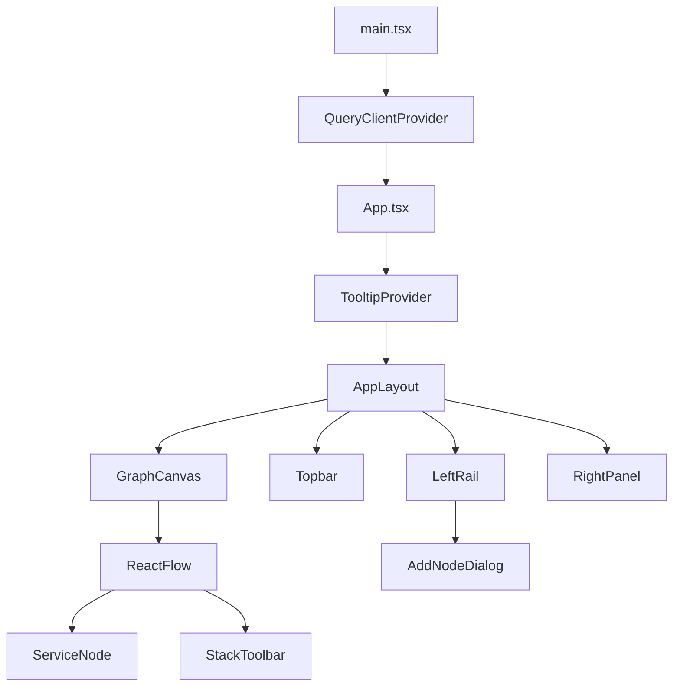
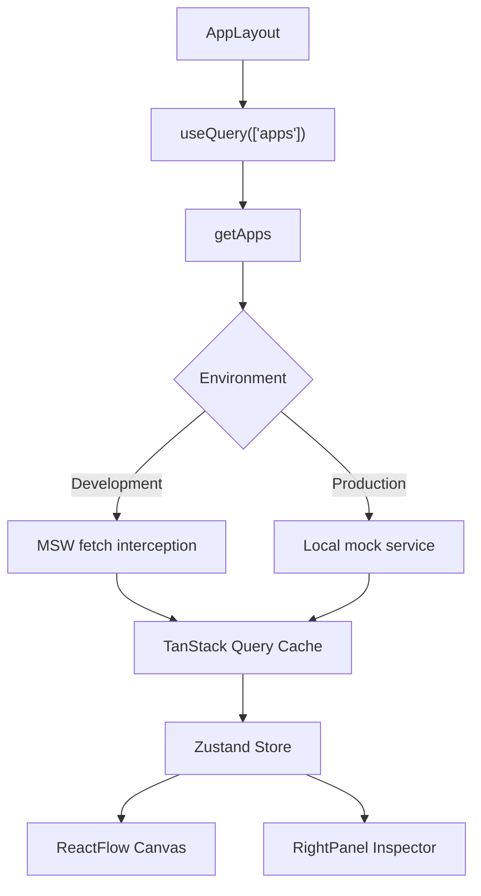
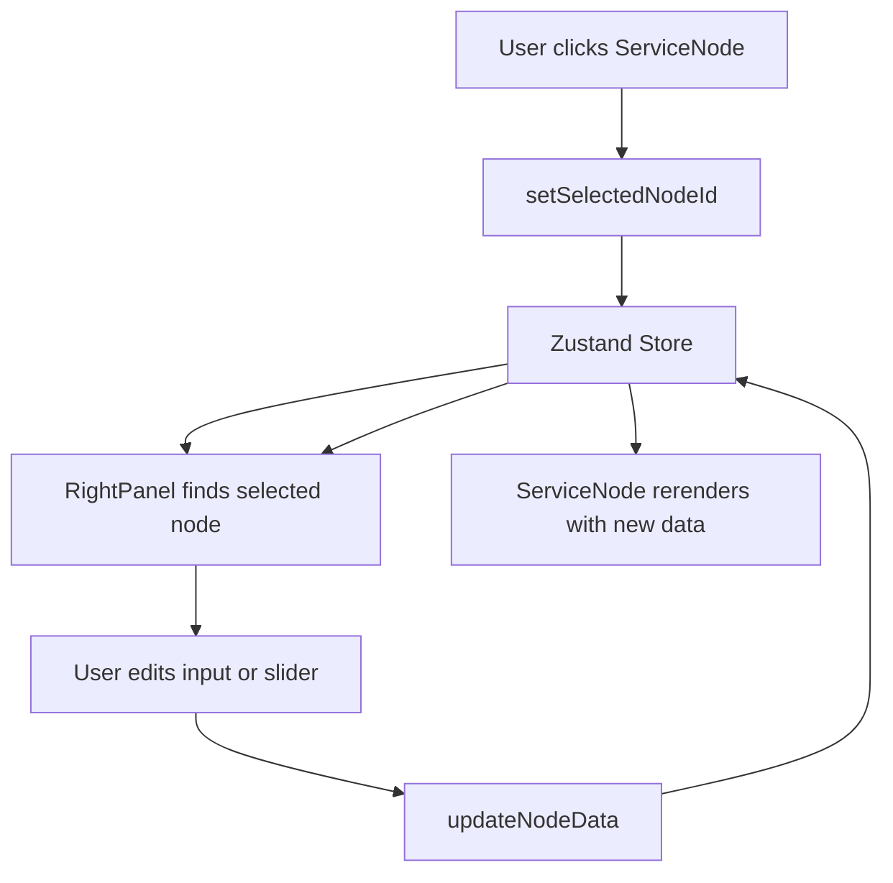
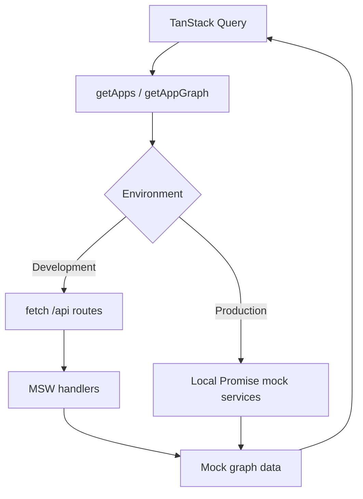
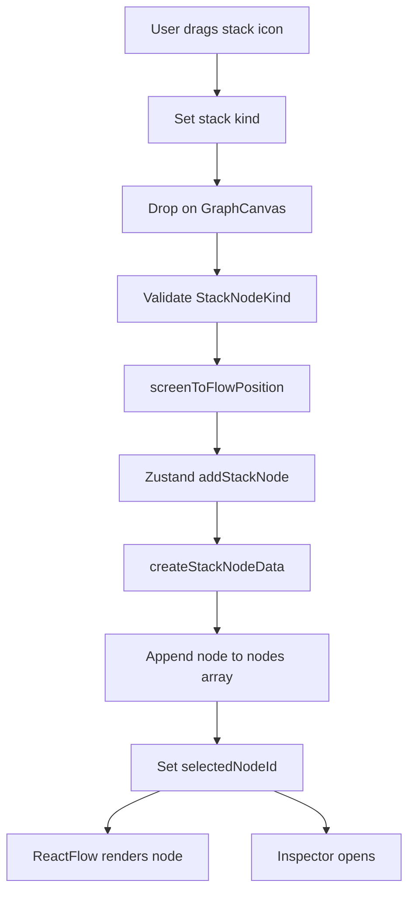
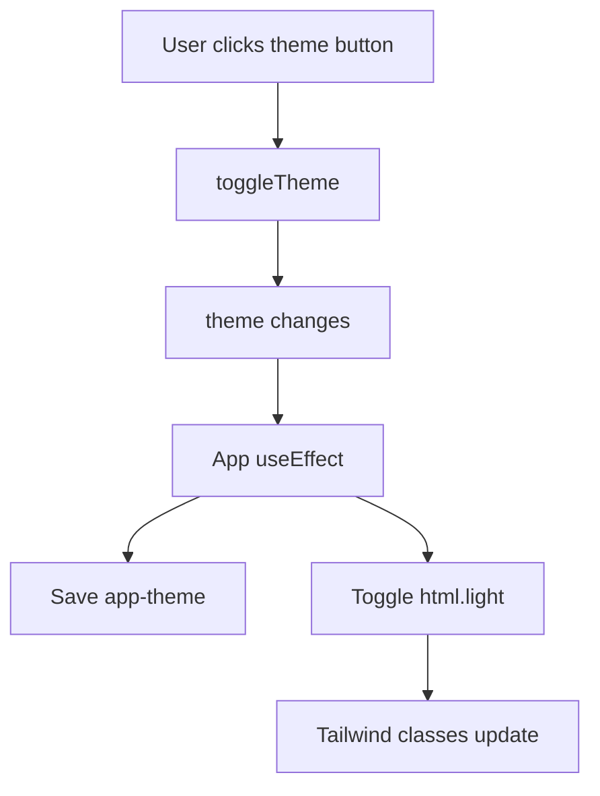

# Interview Preparation Guide

This guide explains the App Graph Builder project in a way that is useful for interviews. It is intentionally practical: first it explains concepts in simple terms, then it connects them to the actual files and code paths in this repository.

## 1. Project Overview

App Graph Builder is a frontend-only infrastructure dashboard. It visualizes applications as interactive service graphs where each service is a draggable ReactFlow node. Users can switch between mock applications, inspect node metrics and configuration, edit node data, delete nodes, toggle dark/light mode, and create new infrastructure nodes by dragging stack icons onto the graph canvas.

The project was built to show production-style frontend architecture for a dashboard assignment. The main goal was not only to make a good-looking UI, but to demonstrate how data fetching, graph rendering, global state, mock APIs, responsive layout, and deployment concerns can work together cleanly.

Major features:

- Interactive infrastructure graph with ReactFlow.
- App switching across multiple mock application graphs.
- Service node inspector with metrics, config, logs, edit controls, and delete confirmation.
- Drag-and-drop infrastructure stack creation from a floating toolbar.
- Zustand-driven graph state for nodes, edges, selected node, sidebar, inspector tabs, theme, and mobile sidebar drawer.
- TanStack Query server-state flow for apps and graphs.
- MSW-backed API simulation in development.
- Production-safe local mock data fallback for Vercel static hosting.
- Responsive desktop layout, mobile sidebar drawer, and mobile inspector drawer.
- Theme persistence through localStorage.

Architecture goals:

- Keep server state separate from UI interaction state.
- Keep ReactFlow controlled by a predictable store.
- Make mock APIs realistic in development.
- Keep production deployment safe without a backend.
- Make major flows easy to explain in interviews.

## 2. Complete Tech Stack Explanation

### React

Simple explanation: React is the UI library. It lets the project build the dashboard from reusable components.

Technical explanation: React components compose the app shell, graph canvas, inspector, topbar, sidebar, dialogs, and UI primitives. State changes from Zustand and TanStack Query cause subscribed components to rerender.

Where it is used:

- `src/App.tsx` handles theme effects and splash screen state.
- `src/components/layout/app-layout.tsx` composes the dashboard shell and queries data.
- `src/components/graph/graph-canvas.tsx` renders ReactFlow.
- `src/components/layout/right-panel.tsx` renders the inspector.

### Vite

Simple explanation: Vite is the development server and production build tool.

Technical explanation: Vite provides fast local development, TypeScript support, import aliases, and optimized production builds in `dist`.

Where it is used:

- `vite.config.ts` configures Vite.
- `npm run dev` starts the local server.
- `npm run build` creates the production bundle for Vercel.

### TypeScript

Simple explanation: TypeScript adds types so mistakes are caught earlier.

Technical explanation: The project types API payloads, graph nodes, service node data, Zustand actions, provider values, service statuses, and drag/drop stack kinds.

Where it is used:

- `src/types.ts` defines `AppSummary`, `ServiceNodeData`, `ServiceNode`, and `GraphPayload`.
- `src/store/app-store.ts` defines store state/actions and `StackNodeKind`.
- `src/components/graph/graph-canvas.tsx` types ReactFlow node types and edge options.

### ReactFlow

Simple explanation: ReactFlow is the graph engine. It handles nodes, edges, dragging, zooming, panning, controls, minimap, and coordinate conversion.

Technical explanation: The app uses ReactFlow as a controlled graph. Nodes and edges live in Zustand, and ReactFlow calls store actions when graph interactions happen.

Where it is used:

- `src/components/graph/graph-canvas.tsx` renders `<ReactFlow />`.
- `src/components/graph/service-node.tsx` defines the custom node.
- `src/store/app-store.ts` stores and mutates nodes/edges.

### Zustand

Simple explanation: Zustand is a lightweight global state store.

Technical explanation: Zustand stores the graph interaction state that multiple components need to read and update. It avoids prop drilling and keeps mutations in one place.

Where it is used:

- `src/store/app-store.ts` defines the store.
- `GraphCanvas`, `ServiceNode`, `RightPanel`, `LeftRail`, `Topbar`, and `App` subscribe to specific state slices.

### TanStack Query

Simple explanation: TanStack Query manages async data loading and caching.

Technical explanation: App and graph data are server state. `AppLayout` uses query keys to fetch and cache apps and graph payloads. When `selectedAppId` changes, the graph query key changes and Query loads the correct graph.

Where it is used:

- `src/main.tsx` creates `QueryClient`.
- `src/components/layout/app-layout.tsx` uses `useQuery`.
- `src/mocks/mock-api.ts` provides the query functions.

### MSW

Simple explanation: MSW mocks backend APIs during development.

Technical explanation: In development, the app calls real browser `fetch()` requests. MSW intercepts `/api/apps` and `/api/apps/:appId/graph`, waits briefly, and returns JSON from mock fixtures.

Where it is used:

- `src/main.tsx` starts MSW only when `import.meta.env.DEV` is true.
- `src/mocks/browser.ts` creates the worker.
- `src/mocks/handlers.ts` defines the route handlers.

### Tailwind CSS

Simple explanation: Tailwind provides utility classes for styling and responsiveness.

Technical explanation: Components use Tailwind utilities for layout, spacing, borders, glassmorphism, transitions, dark/light styling, and responsive breakpoints.

Where it is used:

- Throughout `src/components`.
- `src/index.css` for global styles and splash animations.

### shadcn/ui-style primitives

Simple explanation: These are local reusable UI components built from accessible primitives.

Technical explanation: The project uses local Button, Dialog, AlertDialog, Tabs, Input, Label, Slider, Textarea, and Tooltip components to keep UI patterns consistent.

Where it is used:

- `src/components/ui/*`
- `src/components/layout/right-panel.tsx`
- `src/components/graph/add-node-dialog.tsx`

## 3. Project Architecture Walkthrough

### Folder Structure

Key folders:

- `src/components/graph`: graph canvas, service nodes, stack toolbar, add-node dialog.
- `src/components/layout`: topbar, sidebar, inspector, dashboard shell.
- `src/components/ui`: reusable UI primitives.
- `src/store`: Zustand store.
- `src/mocks`: mock API data, MSW handlers, MSW worker setup.
- `src/lib`: utility helpers and theme status styles.
- `src/types.ts`: shared TypeScript types.

There is no custom `hooks/` folder in the current implementation. React hooks are used directly inside components where the logic belongs.

### Component Hierarchy



### Data Flow



### State Flow

Zustand owns client interaction state:

- selected app
- selected node
- nodes
- edges
- theme
- sidebar state
- mobile sidebar drawer state
- inspector tab state

TanStack Query owns async server-like data:

- apps list
- selected app graph
- loading states
- error states
- caching and retry

### Graph Rendering Flow

1. `AppLayout` loads graph data.
2. `setGraph(graph)` stores nodes and edges in Zustand.
3. `GraphCanvas` subscribes to `nodes` and `edges`.
4. ReactFlow renders controlled nodes and edges.
5. ReactFlow interactions call Zustand actions.
6. Zustand updates state.
7. ReactFlow receives updated props and rerenders.

### Inspector Synchronization

The inspector does not keep its own copy of node data. It reads `selectedNodeId`, finds the matching node from `nodes`, and edits through `updateNodeData`.



## 4. ReactFlow Explanation

### Simple Explanation

ReactFlow is like a canvas for connected boxes. In this project, each box is a service, database, worker, or integration. ReactFlow lets users drag boxes, connect nodes, zoom, pan, and inspect the graph.

### Technical Explanation

`GraphCanvas` renders ReactFlow with:

- `nodes={nodes}` from Zustand
- `edges={styledEdges}` from Zustand
- `nodeTypes={nodeTypes}` mapping `serviceNode` to `ServiceNode`
- `onNodesChange`, `onEdgesChange`, and `onConnect` actions from Zustand
- `onNodeClick` to select a node
- `onPaneClick` to clear selection
- `onDrop` to create new stack nodes

### nodeTypes

`nodeTypes` tells ReactFlow how to render custom node types.

In `graph-canvas.tsx`:

```ts
const nodeTypes = {
  serviceNode: ServiceNode,
} satisfies NodeTypes;
```

Every app graph node has `type: "serviceNode"`, so ReactFlow renders it with `ServiceNode`.

### edgeTypes

This project does not define custom `edgeTypes`. It uses ReactFlow's built-in `smoothstep` edges. That keeps the graph reliable and avoids unnecessary custom edge complexity.

### Custom Nodes

`ServiceNode` renders the infrastructure card. It receives:

- `id`
- `data: ServiceNodeData`

It displays service name, status, CPU, memory, disk, region, provider, and an error message for failed nodes.

### Handles

ReactFlow handles are connection points. In `ServiceNode`, there is:

- a target handle on the left
- a source handle on the right

This makes dependency flow visually readable from left to right.

### Graph Rendering

ReactFlow renders controlled graph data:

- Zustand nodes become ReactFlow nodes.
- Zustand edges become ReactFlow edges.
- `styledEdges` adds consistent color, width, and glow.

### Drag Interactions

When a user drags existing graph nodes, ReactFlow emits node changes. `onNodesChange` applies those changes through Zustand using `applyNodeChanges`.

### Zoom and Pan

ReactFlow provides zoom and pan by default. The project also renders:

- `<Controls />`
- `<MiniMap />`
- `<Background />`

### fitView

`fitView` frames nodes in the viewport. The `ResizeAwareCanvas` helper calls `fitView` after sidebar expansion and selected-node changes so the graph remains visible when layout width changes.

### Dynamic Node Creation

Dynamic nodes can be created in two ways:

- Add Node dialog calls `addNode`.
- Drag/drop stack toolbar calls `addStackNode`.

Both create standard `serviceNode` nodes, so they work with the same inspector, selection, drag, and delete flows.

### Delete Node Flow

Delete works from:

- keyboard Delete or Backspace in `GraphCanvas`
- inspector delete confirmation in `RightPanel`

Both call `deleteSelectedNode`, which removes the selected node and filters out edges where `edge.source` or `edge.target` equals the selected node ID.

### ReactFlow Warnings Fixed

Important decisions:

- `nodeTypes` is defined outside the render function, so ReactFlow does not receive a new object every render.
- `defaultEdgeOptions`, `fitViewOptions`, and `proOptions` are stable module-level constants.
- `onError` ignores ReactFlow warning code `002`, while still logging other warnings.
- `styledEdges` is memoized with `useMemo`.

### How Nodes Are Stored

Nodes are stored in Zustand:

```ts
nodes: ServiceNode[];
edges: Edge[];
```

`ServiceNode` is a typed ReactFlow node:

```ts
export type ServiceNode = Node<ServiceNodeData, "serviceNode">;
```

### How Node Selection Works

1. User clicks a `ServiceNode`.
2. `ServiceNode` stops event propagation and calls `setSelectedNodeId(id)`.
3. `GraphCanvas` also handles `onNodeClick`.
4. `RightPanel` opens because it can derive a selected node.
5. Clicking the pane calls `setSelectedNodeId(null)`.

## 5. Zustand Explanation

### Simple Explanation

Zustand is the shared memory of the app. If multiple components need the same data, that data lives in Zustand.

### Why Zustand Instead of Redux

Zustand fits this project because the state is interactive UI state, not a large enterprise event system. It avoids reducers, action constants, and boilerplate while still keeping state updates centralized.

### Global UI State in This Project

Global state includes:

- `selectedAppId`
- `selectedNodeId`
- `nodes`
- `edges`
- `theme`
- `activeSidebarSection`
- `activeInspectorTab`
- `isSidebarExpanded`
- `isMobileSidebarOpen`

### Selected Node State

`selectedNodeId` is stored instead of storing the entire selected node. This is better because the selected node can always be derived from `nodes`.

### Selected App State

`selectedAppId` controls which graph query runs. When it changes, TanStack Query uses a new key: `["graph", selectedAppId]`.

### Mobile Drawer State

The mobile sidebar drawer uses:

- `isMobileSidebarOpen`
- `openMobileSidebar`
- `closeMobileSidebar`
- `toggleMobileSidebar`

`Topbar` toggles it, and `LeftRail` opens/closes the overlay drawer.

### Sidebar State

The desktop sidebar uses:

- `isSidebarExpanded`
- `sidebarCollapsed`
- `toggleSidebar`
- `selectSidebarSection`

The mobile drawer does not replace desktop behavior; it adds a separate responsive path.

### Inspector Tab State

`activeInspectorTab` stores whether the inspector is showing metrics, config, or logs. This keeps tab selection consistent while the selected node changes.

### What Remains Local Component State

Local state stays local when only one component needs it:

- `App` has `isSplashVisible`.
- `Topbar` has `isAppMenuOpen`.
- `AddNodeDialog` has form fields like name, selected type, provider, region, and status.
- `LeftRail` has `isAddNodeOpen`.

Rule of thumb: if many components need it, Zustand. If only one component needs it, `useState`.

## 6. TanStack Query Explanation

### Simple Explanation

TanStack Query handles data that feels like it came from a server. Even though this assignment uses mock data, the app treats apps and graphs like API responses.

### Server-State Management

Server state is data loaded asynchronously and cached:

- app list
- selected app graph

`AppLayout` uses:

```ts
useQuery({ queryKey: ["apps"], queryFn: getApps })
useQuery({ queryKey: ["graph", selectedAppId], queryFn: ... })
```

### Query Keys

Query keys identify cached data.

- `["apps"]` means the apps list.
- `["graph", selectedAppId]` means the graph for one selected app.

When `selectedAppId` changes, the key changes, so Query loads the new graph.

### Caching

`main.tsx` configures:

```ts
staleTime: 30_000,
retry: 1,
```

That means data is considered fresh for 30 seconds, and failed queries retry once.

### App Switching

When the user selects another app:

1. `setSelectedAppId(app.id)` updates Zustand.
2. `AppLayout` sees a new `selectedAppId`.
3. The graph query key changes.
4. TanStack Query runs `getAppGraph(selectedAppId)`.
5. `setGraph(graph)` updates Zustand.
6. ReactFlow renders the new graph.

### Loading and Error Handling

`AppLayout` passes app query loading/error state into `LeftRail`. It also displays a graph loading badge and graph error message above the canvas.

### UI State vs Server State

UI state examples:

- selected node
- theme
- sidebar open/closed
- inspector tab
- mobile drawer

Server state examples:

- apps fetched from `getApps`
- graph fetched from `getAppGraph`

Interview answer: "I used TanStack Query for data lifecycle and Zustand for interaction state. That separation keeps the app predictable."

## 7. MSW Mock API Explanation

### Simple Explanation

MSW pretends to be a backend during development. The app makes real `fetch()` requests, but MSW catches them and returns mock data.

### How MSW Works Here

In `main.tsx`, MSW starts only in development:

```ts
if (!import.meta.env.DEV) return;
const { worker } = await import("./mocks/browser");
await worker.start({ onUnhandledRequest: "bypass" });
```

`browser.ts` creates the worker:

```ts
setupWorker(...handlers)
```

`handlers.ts` defines routes:

- `GET /api/apps`
- `GET /api/apps/:appId/graph`

The request file is named `mock-api.ts`, but it contains both data and API functions. In development those functions call `fetch()`, which MSW intercepts.

### Why Mock APIs Were Used

This is a frontend assignment, so there is no real backend. MSW lets the project still demonstrate realistic API behavior:

- Network tab shows Fetch/XHR requests.
- TanStack Query works like it would with a backend.
- The app can later replace mocks with real endpoints.

### Development Workflow

1. Run `npm run dev`.
2. `main.tsx` starts MSW.
3. `AppLayout` runs TanStack Query.
4. `getApps` calls `/api/apps`.
5. MSW returns `{ apps: mockApps }`.
6. `getAppGraph` calls `/api/apps/:appId/graph`.
7. MSW returns a cloned graph payload.

## 8. Production Deployment Issue

### What Failed on Vercel

The deployed app showed "Unable to load apps". Locally, the app worked because MSW intercepted `/api/apps`. On Vercel, production did not have a real backend route at `/api/apps`.

### Why APIs Stopped Working

The original mental model depended too much on MSW. MSW is great in development, but production static hosting should not depend on Service Worker interception for app data. A Vercel static build serves files from `dist`; it does not automatically provide `/api/apps` unless an API route is created.

### How Debugging Was Done

The likely debugging flow:

1. Open the deployed Vercel app.
2. See "Unable to load apps".
3. Open browser DevTools.
4. Check the Network tab.
5. Notice `/api/apps` failed or was not handled as expected.
6. Compare with local development where MSW logs show `/api/apps called`.
7. Identify the environment difference: dev has MSW, production needs a different data path.

### How the Network Tab Helped

The Network tab tells whether the browser is actually receiving JSON. If `/api/apps` returns 404, HTML, or no response, TanStack Query fails and the UI shows the error state.

### How the Production Fallback Was Implemented

`mock-api.ts` now branches by environment:

- Development: call `fetch("/api/apps")` and `fetch("/api/apps/:appId/graph")`.
- Production: return local mock data through Promise-based functions with simulated latency.

This preserves the same public API:

- `getApps()`
- `getAppGraph(appId)`

### Development vs Production Architecture



Interview-quality answer:

"The production issue happened because the app was frontend-only but still relied on `/api/apps` behaving like a backend route. Locally MSW intercepted that route, but Vercel static hosting does not provide those endpoints. I fixed it by keeping MSW development-only and adding an environment-aware mock service layer. TanStack Query still calls `getApps` and `getAppGraph`, but in production those functions return cloned local mock data with simulated latency. That made the deployment safe without changing the component architecture."

## 9. Drag-and-Drop Implementation

### Simple Explanation

Users drag a technology icon from the floating toolbar and drop it onto the graph. The app creates a new service node exactly where they dropped it.

### Main Files

- `src/components/graph/stack-toolbar.tsx`
- `src/components/graph/graph-canvas.tsx`
- `src/store/app-store.ts`

### Floating Stack Toolbar

`StackToolbar` renders draggable buttons for:

- GitHub
- PostgreSQL
- Redis
- MongoDB
- Docker
- Kubernetes

Each button sets drag data:

```ts
event.dataTransfer.setData(STACK_DRAG_MIME, stack.kind);
```

### Drop Handling

`GraphCanvas` handles:

- `onDragOver`: allows dropping.
- `onDrop`: reads the stack kind, validates it, converts coordinates, and calls `addStackNode`.

### ReactFlow Coordinate Conversion

Browser mouse coordinates are screen coordinates. ReactFlow graph coordinates are canvas coordinates. `screenToFlowPosition` converts the drop location so nodes appear in the right place even after zooming or panning.

### Node Creation Flow



### Node Metadata Generation

`createStackNodeData(kind)` returns default data based on the dropped stack type. For example, Redis gets `status: "error"` and a cache-oriented description; PostgreSQL gets datastore defaults.

## 10. Responsive Design System

### Mobile Sidebar Drawer

The mobile/tablet sidebar uses Zustand state:

- `isMobileSidebarOpen`
- `openMobileSidebar`
- `closeMobileSidebar`
- `toggleMobileSidebar`

`Topbar` shows a Lucide `Menu` button below `xl`. Clicking it toggles the drawer. `LeftRail` renders a fixed overlay and a slide-in drawer using translate-x transitions. Clicking the overlay, close button, nav item, app item, service item, or add-node button closes the drawer.

### Mobile Inspector Drawer

`RightPanel` is a fixed drawer below `xl`. It opens when `selectedNodeId` points to a valid node. It uses an overlay backdrop and slides in from the right.

### Responsive Breakpoints

Important breakpoints:

- Below `xl`: mobile/tablet drawer behavior for sidebar and inspector.
- `xl` and up: persistent desktop sidebar and inspector layout.

### Desktop vs Mobile Layout

Desktop:

- left sidebar stays persistent
- collapsible expanded sidebar panel
- inspector is part of the main horizontal layout

Mobile/tablet:

- sidebar hidden by default
- menu button opens drawer
- inspector overlays graph when a node is selected
- graph remains primary content

## 11. Theme System

### Simple Explanation

The app supports dark and light themes and remembers the user's choice.

### Technical Flow

Theme is stored in Zustand:

```ts
theme: "dark" | "light"
toggleTheme()
```

`App.tsx` persists theme to localStorage and toggles the `light` class on `document.documentElement`.



### Tailwind Handling

Most components read `theme` from Zustand and apply different Tailwind classes. `theme-styles.ts` centralizes status badge styles for success, warning, and error.

## 12. Interview Questions + Answers

### Why Zustand?

Zustand is a good fit because the app has shared interaction state: selected node, selected app, nodes, edges, theme, sidebar, mobile drawer, and inspector tab. Redux would work, but it would add boilerplate that is unnecessary for this scale. Zustand keeps mutations readable in `app-store.ts`.

### Why ReactFlow?

ReactFlow provides the graph mechanics: custom nodes, handles, drag behavior, edges, zoom, pan, minimap, controls, fitView, and coordinate conversion. Building that from scratch would distract from the assignment goal, which is building a polished infrastructure dashboard.

### Why TanStack Query?

TanStack Query handles server-like async data: apps and graph payloads. It gives caching, loading state, error state, retry, and refetching on query key change. Zustand handles UI state; TanStack Query handles data lifecycle.

### Why MSW?

MSW lets the app use real `fetch()` calls in development without a backend. That makes the Network tab realistic and makes it easy to replace mocks with real backend endpoints later.

### Explain drag/drop architecture.

The toolbar only defines draggable sources. The canvas handles drop and coordinate conversion. Zustand creates and stores the node. ReactFlow renders the new node. This keeps responsibilities separated.

### Explain production deployment issue.

Locally, MSW intercepted `/api/apps`. In production, Vercel static hosting did not provide that route. The app failed to load apps. The fix was to keep MSW development-only and make production return local Promise-based mock data from the same `getApps` and `getAppGraph` functions.

### Explain node synchronization.

Nodes live in Zustand. ReactFlow renders those nodes. The inspector reads the selected node from the same array. When the inspector edits a node, `updateNodeData` updates Zustand, and both the graph node and inspector rerender from the updated state.

### Explain responsive architecture.

Below `xl`, the sidebar and inspector are drawers with fixed positioning and overlays. At `xl`, the desktop persistent layout remains. Zustand controls mobile sidebar open state, while selected node state controls inspector visibility.

### Explain state management flow.

TanStack Query loads data. Zustand stores interactive graph state. ReactFlow receives nodes and edges from Zustand and sends changes back through store actions.

### Explain graph rendering flow.

`AppLayout` fetches graph data, calls `setGraph`, `GraphCanvas` subscribes to nodes and edges, ReactFlow renders the graph, and interactions like drag, connect, select, drop, and delete call Zustand actions.

## 13. File-by-File Explanation

### `src/main.tsx`

Purpose: app entry point.

Responsibilities:

- Create TanStack Query client.
- Start MSW only in development.
- Render React app inside `QueryClientProvider`.

Key logic:

- `staleTime: 30_000`
- `retry: 1`
- `enableMocking()` checks `import.meta.env.DEV`.

### `src/App.tsx`

Purpose: app wrapper.

Responsibilities:

- Persist theme.
- Restore saved theme.
- Show splash screen.
- Wrap dashboard in `TooltipProvider`.

Key hooks:

- `useState` for splash visibility.
- `useEffect` for localStorage theme persistence.
- `useEffect` for splash timer.

### `src/components/layout/app-layout.tsx`

Purpose: main dashboard shell and data orchestration.

Responsibilities:

- Run `["apps"]` query.
- Select first app automatically.
- Run `["graph", selectedAppId]` query.
- Push graph data into Zustand.
- Compose `LeftRail`, `Topbar`, `GraphCanvas`, and `RightPanel`.

### `src/components/graph/graph-canvas.tsx`

Purpose: ReactFlow integration.

Responsibilities:

- Render controlled ReactFlow graph.
- Register `serviceNode` type.
- Style edges.
- Handle node selection.
- Handle pane deselection.
- Handle keyboard deletion.
- Handle drag/drop stack creation.
- Render background, controls, minimap, and stack toolbar.

Key hooks:

- `useRef` stores ReactFlow instance.
- `useEffect` handles Delete and Backspace.
- `useMemo` computes styled edges.
- `useCallback` stabilizes drag/drop handlers.

### `src/components/graph/service-node.tsx`

Purpose: custom ReactFlow service node.

Responsibilities:

- Render service card UI.
- Show metrics, status, region, provider, and error state.
- Render ReactFlow source/target handles.
- Update selected node on click.

### `src/components/graph/stack-toolbar.tsx`

Purpose: floating drag source toolbar.

Responsibilities:

- Render stack icons.
- Set drag data with `STACK_DRAG_MIME`.
- Provide stack kind metadata to `GraphCanvas`.

### `src/components/graph/add-node-dialog.tsx`

Purpose: form-based node creation.

Responsibilities:

- Track local form state.
- Let user choose node type, name, provider, region, and status.
- Call `addNode` in Zustand.
- Reset form on close or submit.

### `src/store/app-store.ts`

Purpose: global interaction state.

Responsibilities:

- Store selected app/node.
- Store nodes and edges.
- Store theme, sidebar, mobile sidebar, and inspector state.
- Apply ReactFlow node/edge changes.
- Add dialog-created nodes.
- Add drag/drop stack nodes.
- Update node data.
- Delete node and connected edges.

### `src/components/layout/right-panel.tsx`

Purpose: inspector panel.

Responsibilities:

- Derive selected node from Zustand.
- Display metrics, config, and logs tabs.
- Update node fields.
- Delete selected node through confirmation dialog.
- Render mobile overlay drawer and desktop panel.

### `src/components/layout/left-rail.tsx`

Purpose: sidebar navigation and app list.

Responsibilities:

- Render desktop sidebar.
- Render mobile/tablet drawer.
- Switch sidebar sections.
- Switch selected app.
- Open add-node dialog.
- Close mobile drawer after navigation.

### `src/components/layout/topbar.tsx`

Purpose: top navigation bar.

Responsibilities:

- Show branding and selected app selector.
- Toggle theme.
- Open mobile sidebar drawer.
- Switch apps from topbar menu.

### `src/mocks/handlers.ts`

Purpose: MSW route handlers.

Responsibilities:

- Handle `GET /api/apps`.
- Handle `GET /api/apps/:appId/graph`.
- Simulate latency.
- Return cloned graph payloads.

### `src/mocks/mock-api.ts`

Purpose: mock data and app-facing API functions.

Responsibilities:

- Store mock apps and graph payloads.
- Clone graph payloads.
- Use dev fetch path with MSW.
- Use production local Promise fallback.

### `src/types.ts`

Purpose: shared app types.

Responsibilities:

- Define app summaries.
- Define service statuses.
- Define node data shape.
- Type ReactFlow service nodes.
- Type graph payloads.

## 14. Engineering Decisions

### Frontend-Only Architecture

The assignment scope was frontend-only. The project still simulates backend behavior, but does not require backend infrastructure.

### Mock APIs

Mock APIs were used to keep the frontend realistic. MSW made local development behave like a real API integration.

### Production Fallback

The local fallback was added because static hosting cannot rely on missing API routes. It preserves async behavior and keeps TanStack Query unchanged.

### Zustand

Zustand was preferred because graph interaction state changes frequently and is shared by many components. It keeps the state layer small and readable.

### ReactFlow

ReactFlow was chosen because it solves complex graph UI problems well. The project adds domain-specific infrastructure UI on top of it.

### Controlled Graph

The graph is controlled through Zustand so all mutations are predictable and centralized.

## 15. Final Interview Cheat Sheet

### 30-Second Explanation

"App Graph Builder is a React and TypeScript infrastructure dashboard. It uses ReactFlow to render service dependency graphs, Zustand for graph interaction state, TanStack Query for app and graph loading, and MSW for development mock APIs. It also supports dragging stack icons onto the canvas to create new editable infrastructure nodes."

### 1-Minute Explanation

"This project is a frontend-only infrastructure graph dashboard. The graph is powered by ReactFlow, but the nodes and edges are controlled by Zustand. TanStack Query loads the app list and selected graph using `getApps` and `getAppGraph`. In development those functions call real fetch requests intercepted by MSW, and in production they return local Promise-based mock data so the Vercel deployment works without a backend. Users can switch apps, inspect and edit nodes, delete nodes with edge cleanup, toggle themes, and create new nodes by dragging technology icons onto the graph."

### 2-Minute Deep Explanation

"The architecture separates server state and interaction state. TanStack Query handles app and graph loading with query keys like `["apps"]` and `["graph", selectedAppId]`. Zustand handles selected app, selected node, nodes, edges, theme, sidebar, mobile drawer, and inspector tabs. AppLayout bridges them by loading graph data and calling `setGraph`. ReactFlow renders a controlled graph from Zustand nodes and edges, and sends changes back through actions like `onNodesChange`, `onEdgesChange`, and `onConnect`. The custom `ServiceNode` displays infrastructure metrics and handles node selection. The inspector derives the selected node from Zustand and updates the same node data, so the graph and inspector stay synchronized. For mock APIs, development uses MSW to intercept fetch calls, while production uses local Promise-based mock services to avoid Vercel API route failures. The standout feature is the drag/drop stack toolbar, where drag data is converted through ReactFlow coordinates and stored as a real graph node."

## 16. Beginner-Friendly Explanations

### React Hooks

Simple: hooks let components remember state or run code after rendering.

In this project:

- `useState` stores local UI state like splash visibility or form inputs.
- `useEffect` runs side effects like saving theme to localStorage or listening for keyboard deletion.
- `useMemo` avoids recalculating styled edges unless edges change.
- `useCallback` keeps drag/drop handlers stable.

### ReactFlow

Simple: ReactFlow is a canvas for boxes and lines.

Project example: each service is a box, and dependencies are lines. The app stores those boxes and lines in Zustand.

### Zustand

Simple: Zustand is shared app memory.

Project example: the graph canvas, inspector, sidebar, and service node all need selected node state, so `selectedNodeId` lives in Zustand.

### TanStack Query

Simple: TanStack Query loads and remembers async data.

Project example: the app list is loaded once and cached. The graph data reloads when `selectedAppId` changes.

### MSW

Simple: MSW pretends to be the backend during local development.

Project example: when the app fetches `/api/apps`, MSW returns the mock app list.

### Drag and Drop

Simple: a dragged icon carries a label like `postgres`. When dropped, the canvas reads that label and creates a node.

Project example: `StackToolbar` sets `STACK_DRAG_MIME`, `GraphCanvas` reads it, and Zustand adds the node.

### TypeScript Types

Simple: types describe what data should look like.

Project example: `ServiceNodeData` requires every node to have `name`, `status`, `cpu`, `memory`, `disk`, `region`, `provider`, `description`, and `logs`.

### Deployment Architecture

Simple: development and production load data differently.

Project example: development uses MSW. Production uses local mock services so Vercel does not need backend routes.

## 17. Code Walkthrough Explanations

### What Triggers Rerenders

Zustand subscriptions trigger rerenders when selected state slices change. For example:

- `GraphCanvas` rerenders when `nodes`, `edges`, or `theme` changes.
- `RightPanel` rerenders when `selectedNodeId`, `nodes`, `activeInspectorTab`, or `theme` changes.
- `ServiceNode` rerenders when selected node or theme changes.

### What State Changes Cause Graph Updates

Graph updates happen when:

- `setGraph` replaces nodes and edges after query data loads.
- `onNodesChange` applies node drag changes.
- `onEdgesChange` applies edge changes.
- `onConnect` adds an edge.
- `addNode` or `addStackNode` appends a node.
- `updateNodeData` changes node metadata.
- `deleteSelectedNode` removes a node and its connected edges.

### How ReactFlow Syncs State

ReactFlow receives `nodes` and `edges` as props. When users interact with the graph, ReactFlow calls handler props. Those handlers update Zustand. Then ReactFlow rerenders with the new props.

### How Inspector Updates Happen

The inspector finds:

```ts
const selectedNode = nodes.find((node) => node.id === selectedNodeId);
```

Then controls call `updateNodeData(selectedNode.id, patch)`. Zustand updates the node in the nodes array.

### How TanStack Query Refetches

The graph query is keyed by selected app:

```ts
queryKey: ["graph", selectedAppId]
```

Changing the selected app changes the key, so Query fetches the new graph.

### useEffect Usage

Examples:

- `main.tsx` waits for MSW setup before rendering.
- `App.tsx` saves theme and manages splash timeout.
- `AppLayout` selects first app and stores loaded graph.
- `GraphCanvas` listens for Delete and Backspace.
- `ResizeAwareCanvas` runs `fitView` after layout changes.

### useState Usage

Examples:

- Splash visibility in `App`.
- Topbar dropdown open state.
- Add node dialog form state.
- Add node dialog open state in `LeftRail`.

### useMemo Usage

`GraphCanvas` uses `useMemo` for `styledEdges` so edge styling is recalculated only when the edges array changes.

### Event Handler Flow

Example: mobile sidebar:

1. Topbar menu button calls `toggleMobileSidebar`.
2. Zustand updates `isMobileSidebarOpen`.
3. `LeftRail` drawer changes translate class.
4. Overlay click calls `closeMobileSidebar`.

## 18. Debugging Stories

### ReactFlow Warnings

Issue: ReactFlow can warn if `nodeTypes` or config objects are recreated every render.

How identified: console warnings.

Fix: move `nodeTypes`, `defaultEdgeOptions`, `fitViewOptions`, and `proOptions` outside render paths.

### Import Alias Issues

Issue: `@/` imports require Vite/TypeScript alias setup.

How identified: TypeScript or Vite module resolution errors.

Fix: ensure project config maps `@` to `src`, then use consistent imports.

### Missing Utility Files

Issue: shared helpers like `cn` or theme styles must exist before components import them.

How identified: build or typecheck module-not-found errors.

Fix: create `src/lib/utils.ts` and `src/lib/theme-styles.ts` with focused helper responsibilities.

### Broken Radix Imports

Issue: shadcn-style UI primitives depend on correct Radix packages and imports.

How identified: TypeScript or runtime import errors.

Fix: keep local UI primitives aligned with installed Radix dependencies.

### Vercel Deployment Issue

Issue: deployed app could not load apps.

How identified: UI showed "Unable to load apps"; Network tab showed API route issue.

Fix: add production local mock service fallback in `mock-api.ts`.

### MSW Production Issue

Issue: relying on MSW in production is fragile for static hosting.

How identified: local dev worked, production failed.

Fix: start MSW only in development and avoid `/api/...` fetches in production.

### Mobile Responsiveness Fixes

Issue: sidebar was not accessible on phone/tablet view.

How identified: small viewport had no usable sidebar navigation.

Fix: add Zustand mobile drawer state, Topbar menu button, overlay, and slide-in drawer in `LeftRail`.

### Sidebar Drawer Fixes

Important fix details:

- Drawer uses fixed positioning.
- Overlay closes drawer on click.
- Sidebar item click closes drawer.
- Desktop layout remains persistent at `xl`.

## 19. TypeScript Explanation

### Why TypeScript

TypeScript makes the project safer by ensuring data shapes match what components expect.

### Interfaces and Types Used

`AppSummary` describes the app selector data:

```ts
id: string;
name: string;
runtime: string;
region: string;
```

`ServiceNodeData` describes what every service node needs:

- icon
- name
- status
- cpu
- memory
- disk
- region
- provider
- description
- logs

### Typing ReactFlow Nodes

```ts
export type ServiceNode = Node<ServiceNodeData, "serviceNode">;
```

This tells TypeScript that every ReactFlow node of this type has `ServiceNodeData`.

### Typing Zustand State

`AppStore` defines every field and action in Zustand. That prevents calling non-existent actions or passing wrong data into actions like `addStackNode`.

### Typing API Responses

`getApps()` returns:

```ts
Promise<{ apps: AppSummary[] }>
```

`getAppGraph()` returns:

```ts
Promise<GraphPayload>
```

### Beginner Example

If a service node accidentally used `provider: "digitalocean"`, TypeScript would reject it because provider is limited to:

```ts
"aws" | "gcp" | "azure"
```

That protects the UI from unknown provider values.

## 20. Final Interview Strategy

### How to Explain the Project Confidently

Start with the product:

"It is an infrastructure graph dashboard where users can inspect services and compose infrastructure visually."

Then explain architecture:

"ReactFlow handles graph rendering, Zustand controls interaction state, TanStack Query handles server-like data, and MSW/local mock services simulate the backend."

### How to Discuss Architecture

Use the separation:

- TanStack Query = data loading/caching.
- Zustand = UI and graph interaction state.
- ReactFlow = graph engine.
- MSW/local services = mock backend strategy.

### How to Answer If Asked About AI Usage

Be honest and engineering-focused:

"I used AI as a coding and review assistant, but I made sure I understood the architecture, debugged issues, ran validation, and can explain the code paths. The important part is that I can walk through the implementation and the tradeoffs."

### How to Explain Debugging Process

Use concrete examples:

- "For Vercel, I compared local dev with production Network tab behavior."
- "For ReactFlow warnings, I stabilized config objects outside render."
- "For mobile sidebar, I checked responsive breakpoints and added drawer state to Zustand."

### How to Explain Deployment Fixes

Say:

"The issue was that production static hosting did not have backend API routes. I kept MSW as a development-only tool and added a production-safe local mock service path. This preserved TanStack Query and component architecture."

### How to Explain State Management

Say:

"The app has two categories of state. Server-like data belongs to TanStack Query. Interaction state belongs to Zustand. Local form/dropdown state stays inside components."

### What to Avoid Saying

Avoid:

- "MSW is my backend."
- "Everything is stored in Zustand."
- "ReactFlow automatically handles all state."
- "Production and development work the same way."
- "I just used libraries."

Better:

- "MSW simulates backend responses in development."
- "TanStack Query owns async data; Zustand owns interaction state."
- "ReactFlow is controlled by Zustand nodes and edges."
- "Production uses local mock services to stay static-hosting safe."

### What Interviewers Likely Care About

Interviewers will likely care about:

- Can you explain why each tool was chosen?
- Can you separate server state from UI state?
- Can you describe ReactFlow controlled graph behavior?
- Can you debug production vs local differences?
- Can you explain responsive behavior?
- Can you discuss tradeoffs honestly?

### How to Sound Confident Without Pretending

Use phrases like:

- "The reason I chose this approach was..."
- "The tradeoff is..."
- "In this project, the important state boundary is..."
- "If this became a real product, the next step would be..."
- "I would replace the mock services with real API endpoints while keeping the query layer the same."

## Study Priority

If time is short, study these first:

1. ReactFlow controlled graph flow in `graph-canvas.tsx`.
2. Zustand store actions in `app-store.ts`.
3. TanStack Query flow in `app-layout.tsx`.
4. MSW vs production fallback in `mock-api.ts`, `handlers.ts`, and `main.tsx`.
5. Drag/drop flow across `stack-toolbar.tsx`, `graph-canvas.tsx`, and `app-store.ts`.
6. Inspector synchronization in `right-panel.tsx`.
7. Mobile sidebar and inspector responsive behavior.
