# System Architecture

This document explains how the Infrastructure Graph Dashboard works internally. It is written for recruiters, interviewers, reviewers, and developers who want to understand the actual implementation in this repository.

The dashboard is a frontend-only React application that renders infrastructure graphs with ReactFlow, manages graph interaction state with Zustand, and fetches mock application data through TanStack Query. In development, MSW intercepts real browser `fetch()` requests. In production, the same API functions return local Promise-based mock data so the Vercel deployment does not depend on Service Worker APIs or backend routes.

## High-Level Summary

The project is organized around four major concerns:

- **Server state:** TanStack Query owns app and graph loading, caching, retry, and refetch behavior.
- **Mock API layer:** MSW intercepts `/api/apps` and `/api/apps/:appId/graph` in development; production uses local Promise-based mock services.
- **Client interaction state:** Zustand stores selected app, selected node, graph nodes, graph edges, sidebar state, inspector tab state, and theme.
- **Graph rendering:** ReactFlow renders controlled nodes and edges from Zustand and reports graph interactions back into the store.

## Overall System Architecture

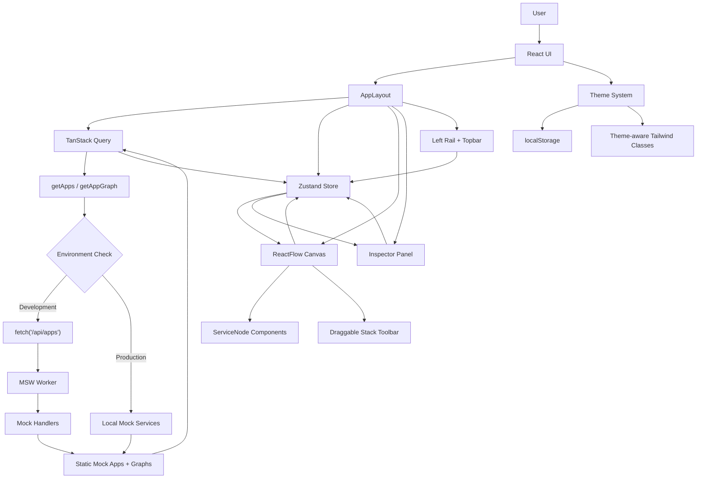

## Application Start Flow

1. Vite loads `src/main.tsx`.
2. A TanStack Query `QueryClient` is created.
3. `enableMocking()` checks `import.meta.env.DEV`.
4. In development, `src/mocks/browser.ts` is dynamically imported and MSW starts before React renders.
5. In production, MSW is skipped completely.
6. React renders `App` inside `QueryClientProvider`.
7. `App` loads persisted theme from `localStorage`.
8. `App` shows the premium splash screen briefly.
9. `AppLayout` mounts.
10. `AppLayout` runs the `["apps"]` query.
11. `getApps()` uses the environment-aware mock API strategy.
12. If no app is selected, the first app becomes `selectedAppId` in Zustand.
13. The graph query `["graph", selectedAppId]` becomes enabled.
14. `getAppGraph()` uses the same environment-aware API layer.
15. `setGraph()` stores nodes and edges in Zustand.
16. `GraphCanvas` renders the ReactFlow graph.
17. `RightPanel` stays closed until a node is selected.

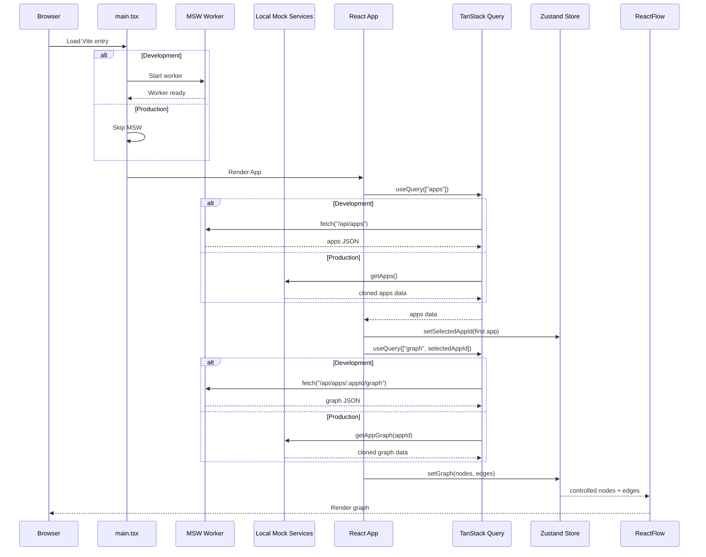

## Frontend Component Hierarchy

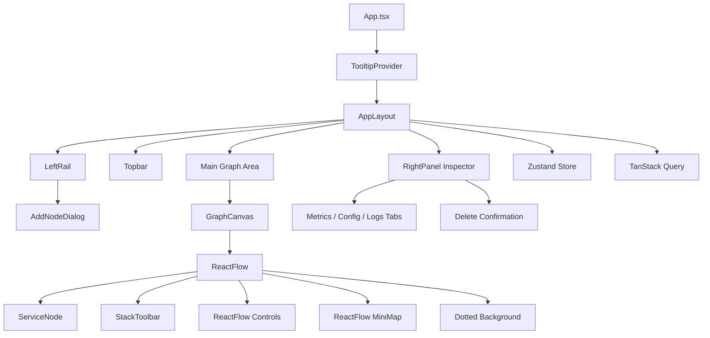

## API Request Flow

The app-facing API functions live in `src/mocks/mock-api.ts`:

- `getApps()`
- `getAppGraph(appId)`

Components do not import mock payloads directly. `AppLayout` uses TanStack Query, and TanStack Query calls these API functions. The functions decide whether to use MSW-backed `fetch()` in development or local Promise-based mock services in production.

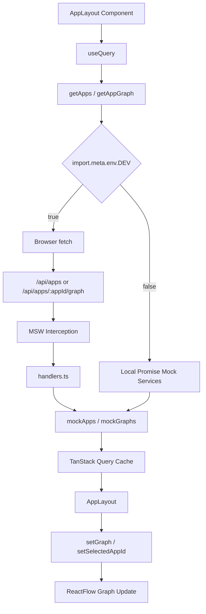

## Environment-Based Data Flow

The project has two data flows that share the same React and TanStack Query surface area.

### Development Flow

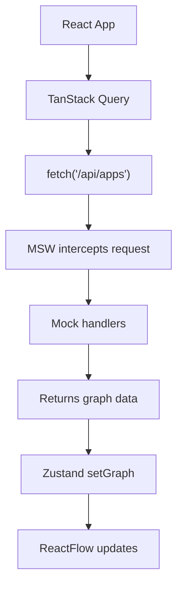

Development intentionally uses browser `fetch()` requests so DevTools shows realistic API traffic and the app behaves like it is connected to backend endpoints.

### Production Flow

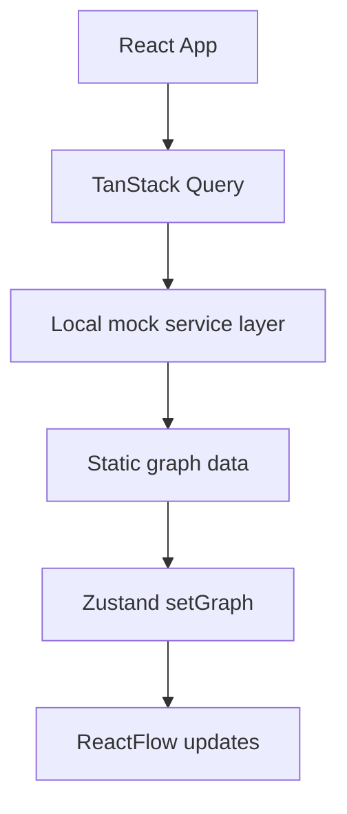

Production avoids `/api/...` routes and does not start MSW. The local mock service layer returns cloned mock data with simulated latency, preserving the same async query behavior while keeping the Vercel deployment static-hosting friendly.

## Mock API Strategy

MSW is used in development because it gives the frontend realistic API behavior without requiring a backend server. The app still calls `fetch("/api/apps")` and `fetch("/api/apps/:appId/graph")`, and the handlers in `src/mocks/handlers.ts` return mock application and graph payloads.

The production fallback exists because a static Vercel deployment should not depend on Service Worker APIs or missing API routes. In production, `getApps()` and `getAppGraph()` return data directly from `mockApps` and `mockGraphs` through Promise-based functions. The graph payload is cloned before being returned so ReactFlow and Zustand can safely mutate graph state without altering the original mock fixtures.

This environment-aware architecture keeps caching consistent. TanStack Query always calls the same functions and uses the same query keys:

- `["apps"]`
- `["graph", selectedAppId]`

Only the implementation behind those functions changes by environment. That keeps the frontend-first workflow easy to replace with real backend endpoints later while remaining deployment-safe today.

## MSW Mock API Interception

MSW is started only in development from `src/main.tsx`:

```ts
const { worker } = await import("./mocks/browser");
await worker.start({ onUnhandledRequest: "bypass" });
```

The worker is created in `src/mocks/browser.ts` using:

```ts
setupWorker(...handlers)
```

The handlers are in `src/mocks/handlers.ts`.

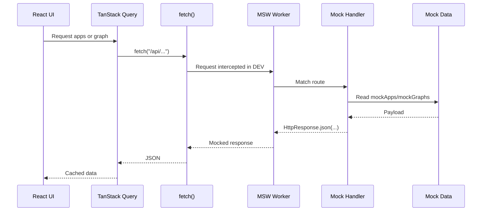

## Zustand State Flow

Zustand is the source of truth for graph interaction state.

Important store fields:

- `selectedAppId`
- `selectedNodeId`
- `nodes`
- `edges`
- `theme`
- `activeSidebarSection`
- `activeInspectorTab`
- `isSidebarExpanded`

Important actions:

- `setSelectedAppId`
- `setSelectedNodeId`
- `setGraph`
- `addNode`
- `addStackNode`
- `onNodesChange`
- `onEdgesChange`
- `onConnect`
- `updateNodeData`
- `deleteSelectedNode`
- `toggleTheme`

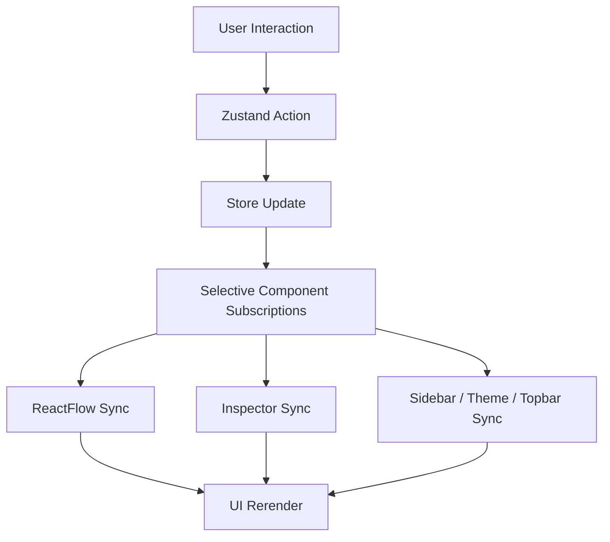

## ReactFlow Rendering Pipeline

`GraphCanvas` renders ReactFlow as a controlled graph:

- `nodes` come from Zustand.
- `edges` come from Zustand.
- `nodeTypes` is defined outside render and maps `serviceNode` to `ServiceNode`.
- `defaultEdgeOptions`, `fitViewOptions`, and `proOptions` are stable module-level constants.
- Edge styling is memoized with `useMemo`.

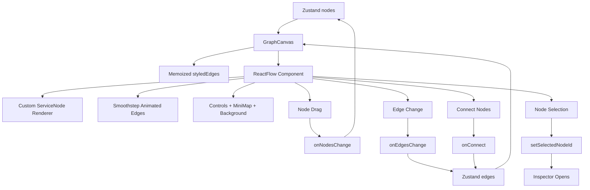

## App Switching Workflow

Users can switch applications from the topbar selector or sidebar app list.

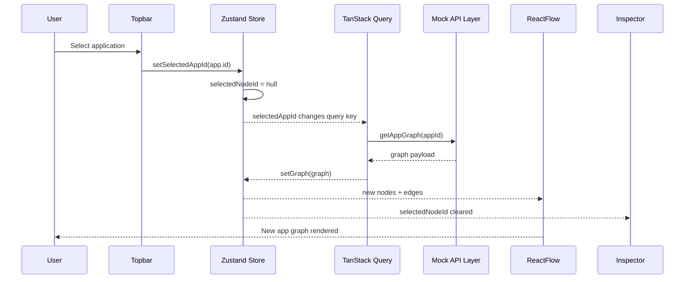

## Node Selection Flow

Node selection is driven by ReactFlow click events and Zustand state.

```mermaid
flowchart TD
  User[User clicks node] --> ReactFlowClick[ReactFlow onNodeClick]
  ReactFlowClick --> StoreAction[setSelectedNodeId(node.id)]
  StoreAction --> Store[Zustand selectedNodeId]
  Store --> RightPanel[RightPanel reads selected node]
  RightPanel --> Tabs[Metrics / Config / Logs]
  RightPanel --> Inputs[Editable Inputs + Sliders]
  Inputs --> UpdateAction[updateNodeData]
  UpdateAction --> Store
  Store --> ServiceNode[ServiceNode rerenders]
```

## Inspector Synchronization

The inspector does not keep a separate copy of node data. It derives the selected node from Zustand:

1. `RightPanel` reads `selectedNodeId`.
2. It finds the matching node in `nodes`.
3. Inputs and sliders display the selected node data.
4. Edits call `updateNodeData`.
5. Zustand updates the node.
6. ReactFlow rerenders the same node card with updated data.

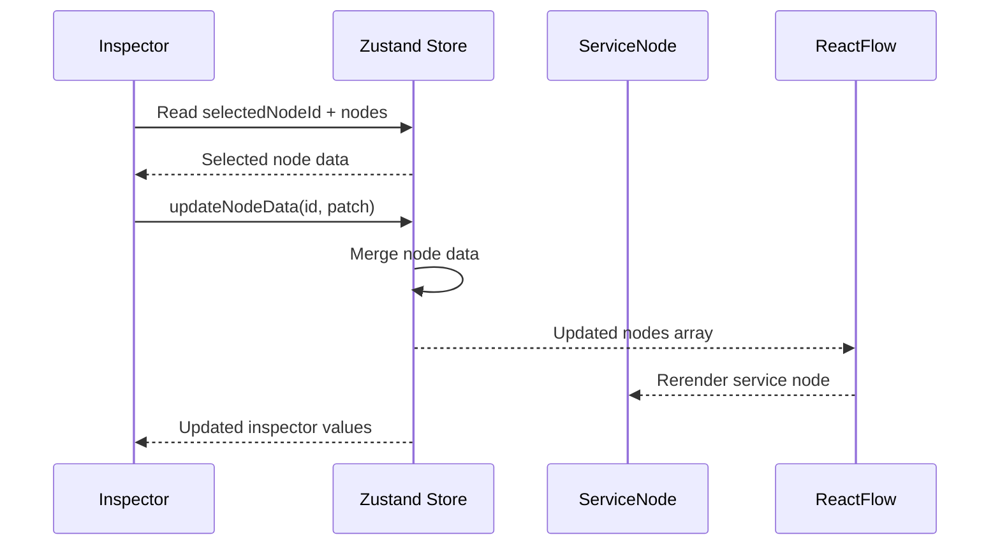

## Drag-and-Drop Workflow

The dashboard supports dynamic infrastructure node creation by dragging technology stack icons directly onto the graph canvas.

Supported stack icons:

- PostgreSQL
- Redis
- MongoDB
- Docker
- Kubernetes
- GitHub

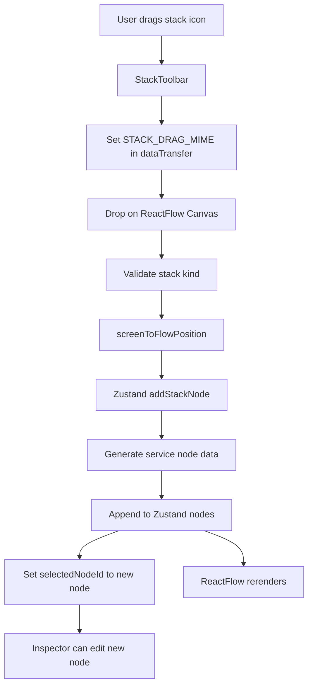

Implementation files:

- `src/components/graph/stack-toolbar.tsx`
- `src/components/graph/graph-canvas.tsx`
- `src/store/app-store.ts`

Why it works well:

- `StackToolbar` only owns drag source behavior.
- `GraphCanvas` owns canvas drop handling and coordinate conversion.
- Zustand owns graph mutation.
- `ServiceNode` renders generated nodes the same way it renders API-loaded nodes.

## Node Delete Flow

Deletion is centralized in Zustand so keyboard deletion and inspector deletion share the same behavior.

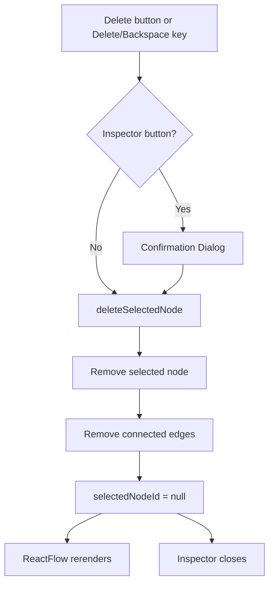

## Theme System Flow

Theme state is stored in Zustand and persisted to `localStorage`.

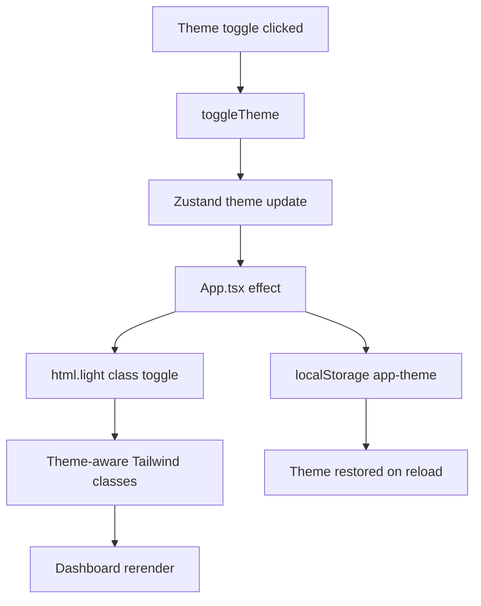

Implementation details:

- `App.tsx` persists the theme.
- `Topbar` calls `toggleTheme`.
- Components read `theme` from Zustand and apply theme-specific class names.
- Light mode adds the `light` class to `document.documentElement`.

## Responsive UI Behavior

The layout uses responsive Tailwind classes and state-driven sidebar behavior.

Key behavior:

- The left icon rail remains compact.
- The expanded app/sidebar panel can collapse and expand.
- The inspector is static on large screens and becomes a fixed overlay on smaller screens.
- The mobile overlay uses a backdrop so users can close the inspector by clicking outside it.
- Graph fit view runs after sidebar and selection changes to keep nodes framed.

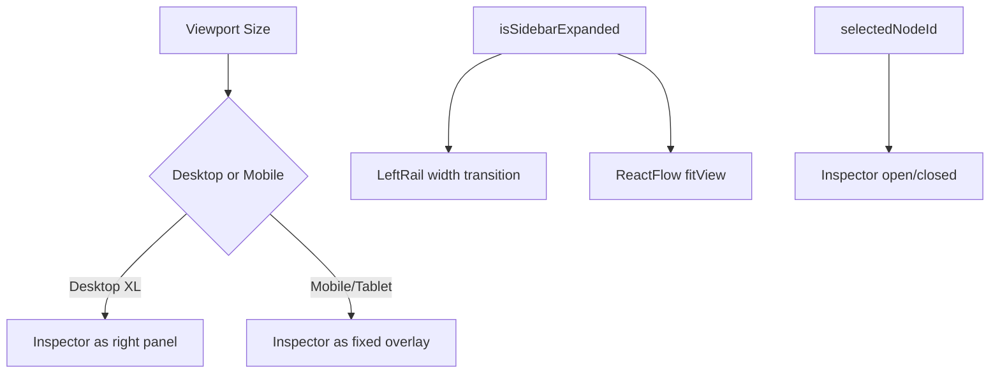

## Performance Notes

The implementation includes several practical performance decisions:

- **Stable ReactFlow config:** `nodeTypes`, `defaultEdgeOptions`, `fitViewOptions`, and `proOptions` are defined outside component renders.
- **No custom edgeTypes churn:** the app uses built-in ReactFlow smoothstep edges and does not pass unnecessary custom `edgeTypes`.
- **Memoized styled edges:** `styledEdges` is memoized from the Zustand `edges` array.
- **Selective Zustand subscriptions:** components subscribe to only the state slices they need.
- **TanStack Query caching:** app and graph responses are cached by query key.
- **Controlled graph state:** ReactFlow changes are applied through Zustand actions instead of scattered local state.
- **Fit view timing:** `ResizeAwareCanvas` uses requestAnimationFrame and timeout after sidebar transitions to avoid abrupt graph framing.
- **MSW in development only:** production builds are not blocked by the mock worker or missing API routes.
- **Production mock fallback:** production data comes from local Promise-based services, preserving async behavior without Service Worker dependency.
- **CSS transitions:** visual polish uses Tailwind/CSS transitions instead of heavy runtime animation dependencies.

## Deployment Architecture

The app is deployed on Vercel as a static Vite single-page application:

https://app-graph-builder-one.vercel.app/

The deployment has no runtime backend dependency. Vercel serves the compiled files from `dist`, and the production bundle uses local mock services for application and graph data.

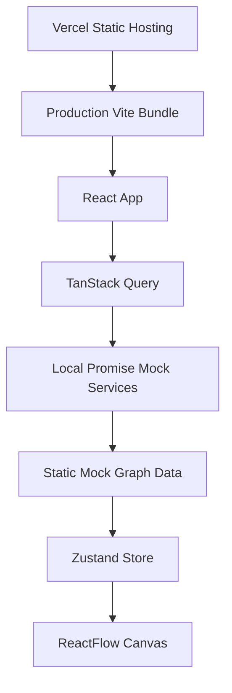

Development and production are intentionally different at the data transport layer:

- Development uses MSW to intercept `fetch()` requests and simulate backend endpoints.
- Production uses local mock services so the app works without Service Worker registration or API routes.
- TanStack Query, Zustand, ReactFlow, app switching, and inspector behavior remain the same in both environments.

## Architecture Benefits

- **Scalable frontend architecture:** API loading, graph interaction state, visual graph rendering, and inspector editing are separated into clear ownership boundaries.
- **Realistic API simulation:** development uses MSW and real `fetch()` calls, making the app easy to explain and easy to migrate to a backend.
- **Deployment-safe mocking:** production avoids network calls to missing `/api/...` routes and avoids Service Worker dependency.
- **Predictable graph state management:** Zustand centralizes graph mutations, node selection, app switching, inspector edits, and edge cleanup.
- **Responsive UX architecture:** sidebar and inspector behavior respond to viewport size while keeping ReactFlow framed with fit-view timing.
- **ReactFlow optimization strategy:** stable config objects and memoized edge styling reduce unnecessary graph rerenders and warning noise.

## How to Explain the Architecture in Interviews

### Why Zustand Instead of Redux?

Zustand is lightweight and direct. The project needs shared UI interaction state, not a large event/action architecture. Zustand keeps graph mutations readable:

- `setGraph`
- `addStackNode`
- `updateNodeData`
- `deleteSelectedNode`

It also avoids boilerplate while still making state flow explicit.

### Why TanStack Query?

TanStack Query is designed for server state. It handles:

- fetching
- loading states
- error states
- retry behavior
- caching
- graph refetching when `selectedAppId` changes

This keeps API data concerns separate from local graph interaction state.

### Why MSW?

MSW allows the frontend to make real browser `fetch()` requests in development while still using mock data. This means DevTools shows realistic Fetch/XHR traffic:

- `/api/apps`
- `/api/apps/:appId/graph`

It also makes the app easier to replace with a real backend later because components already use API functions. Production uses local Promise-based mock services behind the same functions so the deployed Vercel app stays backend-free and Service Worker independent.

### Why ReactFlow?

ReactFlow provides graph interactions that would be expensive to build from scratch:

- custom nodes
- node dragging
- edge rendering
- connection handling
- zoom/pan
- minimap
- controls
- coordinate conversion for drag/drop

The project uses ReactFlow for the graph engine and focuses custom work on infrastructure-specific UX.

### Scalability Discussion

The current architecture can scale by:

- adding more MSW handlers or replacing them with real backend endpoints
- adding more node types to `ServiceNodeData`
- adding custom ReactFlow edge types if needed
- persisting graph edits to an API
- extending Zustand actions for duplication, grouping, or node templates
- adding query invalidation after backend mutations

### Component Separation Strategy

The dashboard keeps responsibilities separated:

- `AppLayout` composes the shell and owns data queries.
- `GraphCanvas` owns ReactFlow interactions.
- `ServiceNode` owns visual node rendering.
- `StackToolbar` owns drag sources.
- `RightPanel` owns selected-node editing.
- Zustand owns graph mutations.
- MSW owns development mock API responses.
- Local mock services own production fallback responses.

This separation makes the project easier to evaluate, maintain, and extend.

## End-to-End Workflow Summary

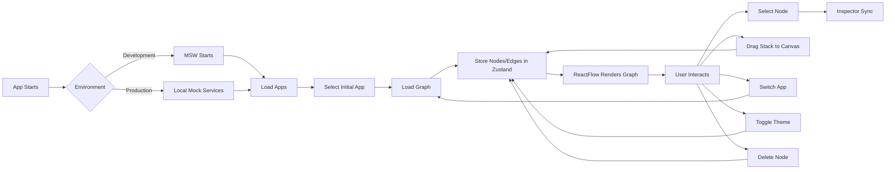

## Final Notes

This architecture intentionally separates API data, graph interaction state, and visual rendering:

- TanStack Query handles API lifecycle.
- MSW provides realistic development API responses.
- Local Promise-based mock services provide production-safe data for Vercel.
- Zustand controls graph interaction state.
- ReactFlow renders and updates the graph.
- The inspector, sidebar, topbar, and stack toolbar consume the same store-driven graph state.

That structure makes the dashboard feel interactive and production-like while remaining easy to explain in an interview and safe to deploy as a static frontend.
