# System Architecture

This document explains how the Infrastructure Graph Dashboard works internally. It is written for recruiters, interviewers, reviewers, and developers who want to understand the actual implementation in this repository.

The dashboard is a frontend-only React application that renders infrastructure graphs with ReactFlow, manages graph interaction state with Zustand, fetches mock API data through TanStack Query, and intercepts real browser `fetch()` requests with MSW in development.

## High-Level Summary

The project is organized around four major concerns:

- **Server state:** TanStack Query fetches app and graph data through real `fetch()` calls.
- **Mock API layer:** MSW intercepts `/api/apps` and `/api/apps/:appId/graph` in development.
- **Client interaction state:** Zustand stores selected app, selected node, graph nodes, graph edges, sidebar state, inspector tab state, and theme.
- **Graph rendering:** ReactFlow renders controlled nodes and edges from Zustand and reports graph interactions back into the store.

## Overall System Architecture

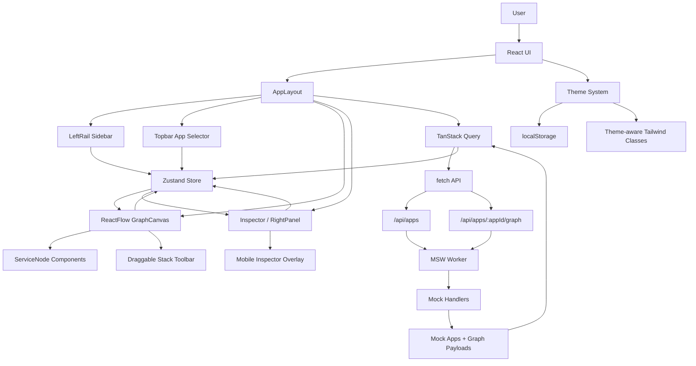

## Application Start Flow

1. Vite loads `src/main.tsx`.
2. A TanStack Query `QueryClient` is created.
3. In development, `enableMocking()` dynamically imports `src/mocks/browser.ts`.
4. MSW starts before React renders.
5. React renders `App` inside `QueryClientProvider`.
6. `App` loads persisted theme from `localStorage`.
7. `App` shows the premium splash screen briefly.
8. `AppLayout` mounts.
9. `AppLayout` runs the `["apps"]` query.
10. `getApps()` calls `fetch("/api/apps")`.
11. MSW intercepts the request and returns mock apps.
12. If no app is selected, the first app becomes `selectedAppId` in Zustand.
13. The graph query `["graph", selectedAppId]` becomes enabled.
14. `getAppGraph()` calls `fetch("/api/apps/:appId/graph")`.
15. MSW returns the graph payload.
16. `setGraph()` stores nodes and edges in Zustand.
17. `GraphCanvas` renders the ReactFlow graph.
18. `RightPanel` stays closed until a node is selected.

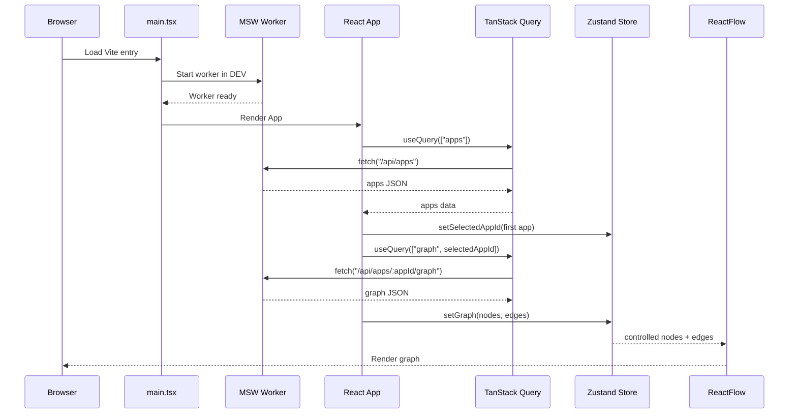

## Frontend Component Hierarchy

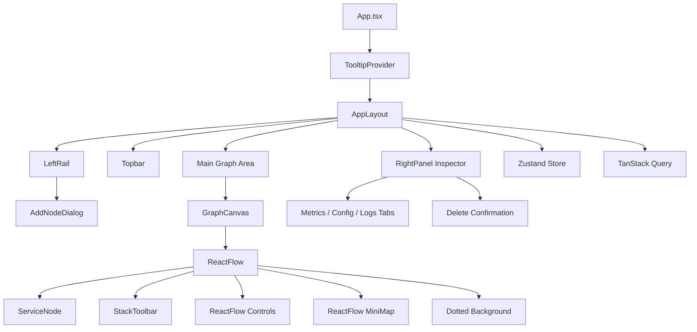

## API Request Flow

The project intentionally uses real `fetch()` calls. Mock data is not read directly by components. The app-facing API functions live in `src/mocks/mock-api.ts`, but they call network endpoints:

- `fetch("/api/apps")`
- `fetch("/api/apps/${appId}/graph")`

In development, MSW intercepts those requests.

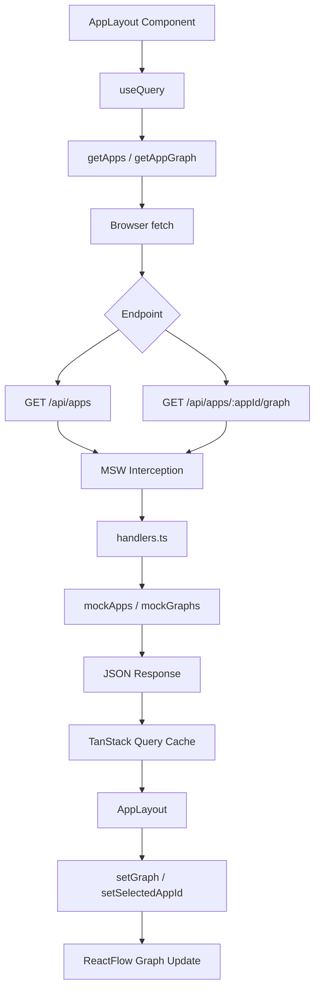

## MSW Mock API Interception

MSW is started only in development from `src/main.tsx`:

```ts
const { worker } = await import("./mocks/browser");
await worker.start({ onUnhandledRequest: "bypass" });
```

The worker is created in `src/mocks/browser.ts` using:

```ts
setupWorker(...handlers)
```

The handlers are in `src/mocks/handlers.ts`.

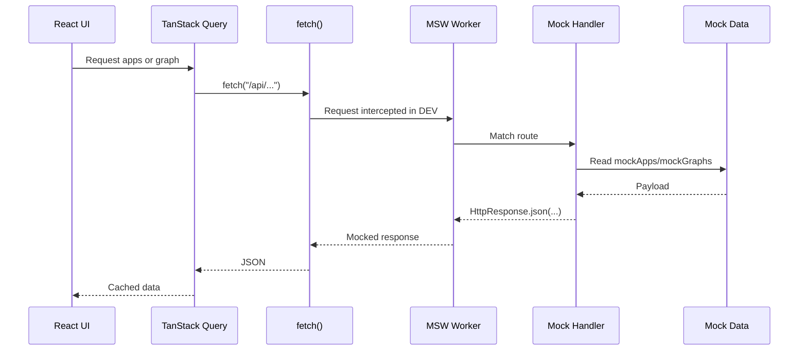

## Zustand State Flow

Zustand is the source of truth for graph interaction state.

Important store fields:

- `selectedAppId`
- `selectedNodeId`
- `nodes`
- `edges`
- `theme`
- `activeSidebarSection`
- `activeInspectorTab`
- `isSidebarExpanded`

Important actions:

- `setSelectedAppId`
- `setSelectedNodeId`
- `setGraph`
- `addNode`
- `addStackNode`
- `onNodesChange`
- `onEdgesChange`
- `onConnect`
- `updateNodeData`
- `deleteSelectedNode`
- `toggleTheme`

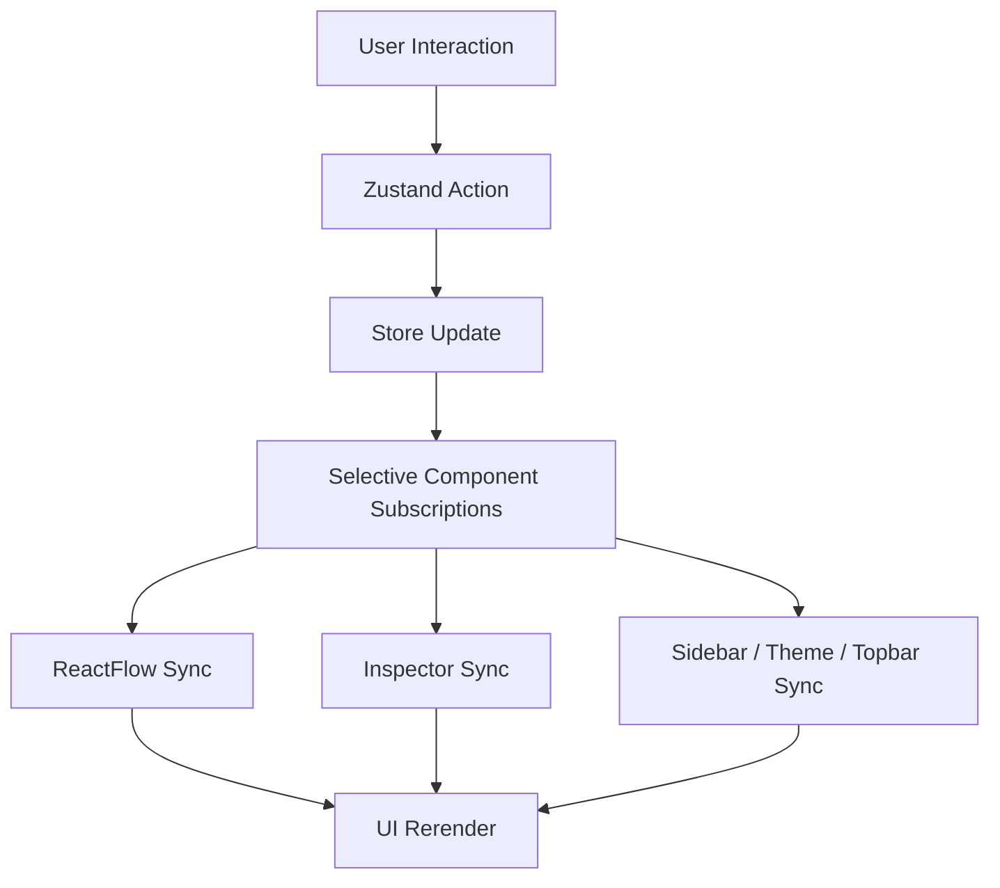

## ReactFlow Rendering Pipeline

`GraphCanvas` renders ReactFlow as a controlled graph:

- `nodes` come from Zustand.
- `edges` come from Zustand.
- `nodeTypes` is defined outside render and maps `serviceNode` to `ServiceNode`.
- `defaultEdgeOptions`, `fitViewOptions`, and `proOptions` are stable module-level constants.
- Edge styling is memoized with `useMemo`.

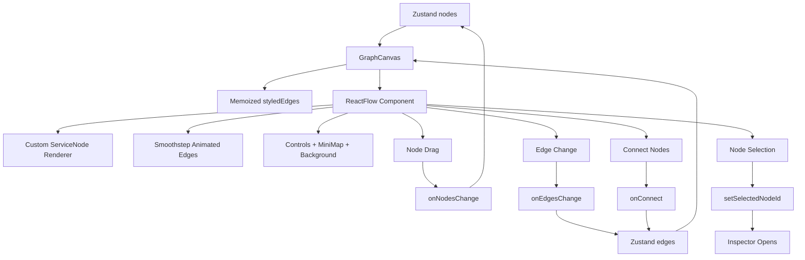

## App Switching Workflow

Users can switch applications from the topbar selector or sidebar app list.

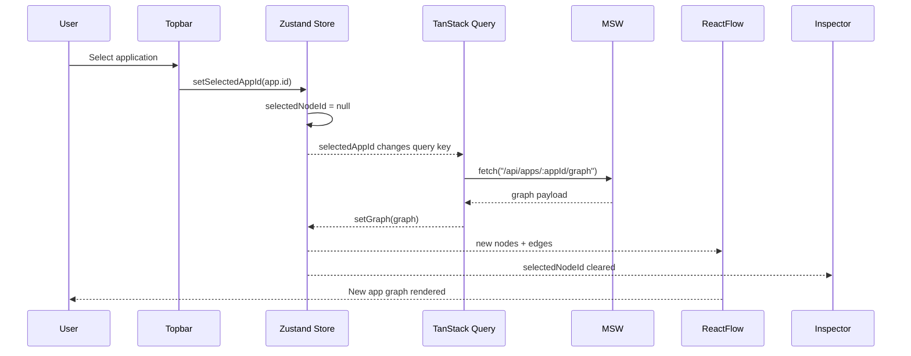

## Node Selection Flow

Node selection is driven by ReactFlow click events and Zustand state.

```mermaid
flowchart TD
  User[User clicks node] --> ReactFlowClick[ReactFlow onNodeClick]
  ReactFlowClick --> StoreAction[setSelectedNodeId(node.id)]
  StoreAction --> Store[Zustand selectedNodeId]
  Store --> RightPanel[RightPanel reads selected node]
  RightPanel --> Tabs[Metrics / Config / Logs]
  RightPanel --> Inputs[Editable Inputs + Sliders]
  Inputs --> UpdateAction[updateNodeData]
  UpdateAction --> Store
  Store --> ServiceNode[ServiceNode rerenders]
```

## Inspector Synchronization

The inspector does not keep a separate copy of node data. It derives the selected node from Zustand:

1. `RightPanel` reads `selectedNodeId`.
2. It finds the matching node in `nodes`.
3. Inputs and sliders display the selected node data.
4. Edits call `updateNodeData`.
5. Zustand updates the node.
6. ReactFlow rerenders the same node card with updated data.

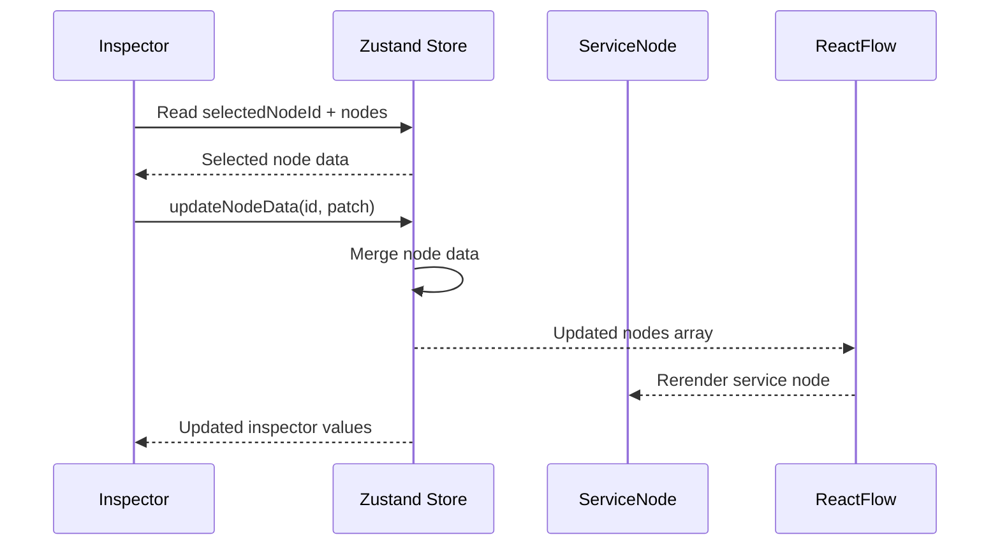

## Drag-and-Drop Workflow

The dashboard supports dynamic infrastructure node creation by dragging technology stack icons directly onto the graph canvas.

Supported stack icons:

- PostgreSQL
- Redis
- MongoDB
- Docker
- Kubernetes
- GitHub

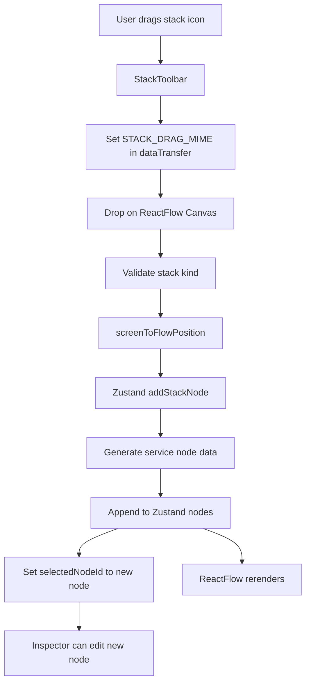

Implementation files:

- `src/components/graph/stack-toolbar.tsx`
- `src/components/graph/graph-canvas.tsx`
- `src/store/app-store.ts`

Why it works well:

- `StackToolbar` only owns drag source behavior.
- `GraphCanvas` owns canvas drop handling and coordinate conversion.
- Zustand owns graph mutation.
- `ServiceNode` renders generated nodes the same way it renders API-loaded nodes.

## Node Delete Flow

Deletion is centralized in Zustand so keyboard deletion and inspector deletion share the same behavior.

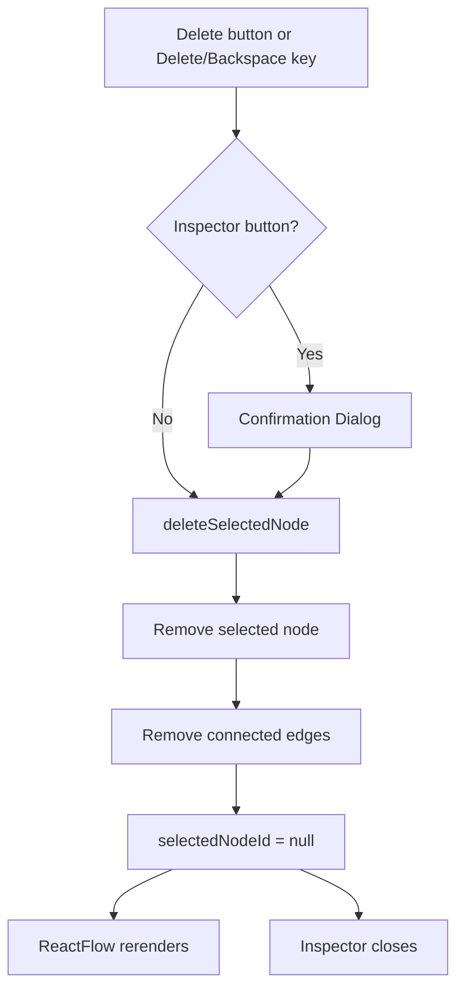

## Theme System Flow

Theme state is stored in Zustand and persisted to `localStorage`.

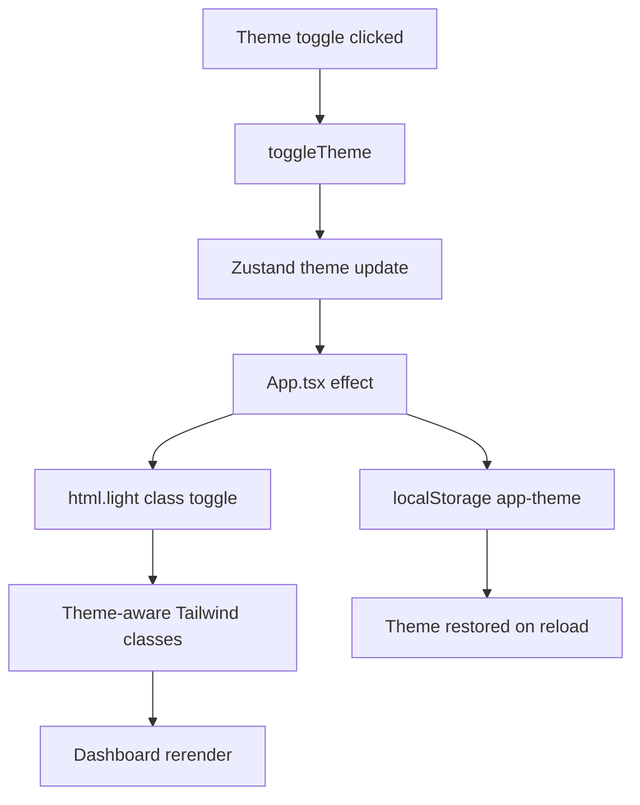

Implementation details:

- `App.tsx` persists the theme.
- `Topbar` calls `toggleTheme`.
- Components read `theme` from Zustand and apply theme-specific class names.
- Light mode adds the `light` class to `document.documentElement`.

## Responsive UI Behavior

The layout uses responsive Tailwind classes and state-driven sidebar behavior.

Key behavior:

- The left icon rail remains compact.
- The expanded app/sidebar panel can collapse and expand.
- The inspector is static on large screens and becomes a fixed overlay on smaller screens.
- The mobile overlay uses a backdrop so users can close the inspector by clicking outside it.
- Graph fit view runs after sidebar and selection changes to keep nodes framed.

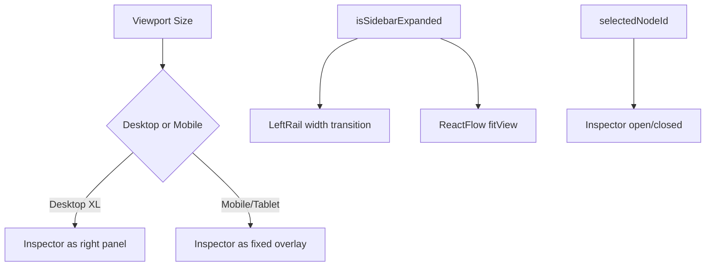

## Performance Notes

The implementation includes several practical performance decisions:

- **Stable ReactFlow config:** `nodeTypes`, `defaultEdgeOptions`, `fitViewOptions`, and `proOptions` are defined outside component renders.
- **No custom edgeTypes churn:** the app uses built-in ReactFlow smoothstep edges and does not pass unnecessary custom `edgeTypes`.
- **Memoized styled edges:** `styledEdges` is memoized from the Zustand `edges` array.
- **Selective Zustand subscriptions:** components subscribe to only the state slices they need.
- **TanStack Query caching:** app and graph responses are cached by query key.
- **Controlled graph state:** ReactFlow changes are applied through Zustand actions instead of scattered local state.
- **Fit view timing:** `ResizeAwareCanvas` uses requestAnimationFrame and timeout after sidebar transitions to avoid abrupt graph framing.
- **MSW in development only:** production builds are not blocked by the mock worker.
- **CSS transitions:** visual polish uses Tailwind/CSS transitions instead of heavy runtime animation dependencies.

## How to Explain the Architecture in Interviews

### Why Zustand Instead of Redux?

Zustand is lightweight and direct. The project needs shared UI interaction state, not a large event/action architecture. Zustand keeps graph mutations readable:

- `setGraph`
- `addStackNode`
- `updateNodeData`
- `deleteSelectedNode`

It also avoids boilerplate while still making state flow explicit.

### Why TanStack Query?

TanStack Query is designed for server state. It handles:

- fetching
- loading states
- error states
- retry behavior
- caching
- graph refetching when `selectedAppId` changes

This keeps API data concerns separate from local graph interaction state.

### Why MSW?

MSW allows the frontend to make real browser `fetch()` requests while still using mock data. This means DevTools shows realistic Fetch/XHR traffic:

- `/api/apps`
- `/api/apps/:appId/graph`

It also makes the app easier to replace with a real backend later because components already use API calls.

### Why ReactFlow?

ReactFlow provides graph interactions that would be expensive to build from scratch:

- custom nodes
- node dragging
- edge rendering
- connection handling
- zoom/pan
- minimap
- controls
- coordinate conversion for drag/drop

The project uses ReactFlow for the graph engine and focuses custom work on infrastructure-specific UX.

### Scalability Discussion

The current architecture can scale by:

- adding more MSW handlers or replacing them with real backend endpoints
- adding more node types to `ServiceNodeData`
- adding custom ReactFlow edge types if needed
- persisting graph edits to an API
- extending Zustand actions for duplication, grouping, or node templates
- adding query invalidation after backend mutations

### Component Separation Strategy

The dashboard keeps responsibilities separated:

- `AppLayout` composes the shell and owns data queries.
- `GraphCanvas` owns ReactFlow interactions.
- `ServiceNode` owns visual node rendering.
- `StackToolbar` owns drag sources.
- `RightPanel` owns selected-node editing.
- Zustand owns graph mutations.
- MSW owns mock API responses.

This separation makes the project easier to evaluate, maintain, and extend.

## End-to-End Workflow Summary

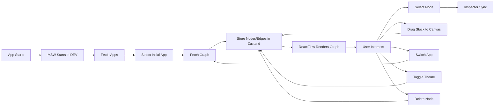

## Final Notes

This architecture intentionally separates API data, graph interaction state, and visual rendering:

- TanStack Query handles API lifecycle.
- MSW provides realistic development API responses.
- Zustand controls graph interaction state.
- ReactFlow renders and updates the graph.
- The inspector, sidebar, topbar, and stack toolbar consume the same store-driven graph state.

That structure makes the dashboard feel interactive and production-like while remaining easy to explain in an interview.
